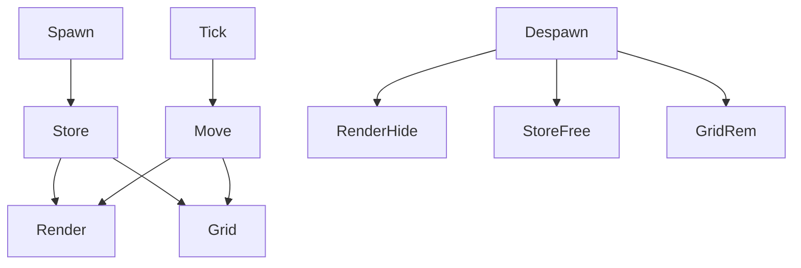

# Phase A: GPU-instanced bacteria rendering (MultiMesh)

Goal
- Remove startup stall by eliminating bacteria pooling/scene instantiation and rendering all bacteria via MultiMeshInstance2D with a canvas_item shader.
- Keep external spawning/destroy APIs stable while swapping internals to array-based data and a single renderer.

Scope (Phase A)
- Implement renderer, store, and system for bacteria.
- Add config flags and wire into existing factory.
- Integrate into scene and provide minimal wander behavior.
- Logging/metrics to verify stall removal and runtime stability.
- Rollback switch to restore node-based path for debugging.

Deferred to Phase B (after Human user verifies Phase A is completed)
- Advanced shader variants and visual polish (SDF beyond basics, per-instance rotation in shader).
- Port complex behaviors (SeekNutrient) to array updates.
- Performance tuning and GPU profiling; optional batched commit path.
- Nutrient migration to GPU instancing.
- Cleanup/deprecation of bacteria pool config and docs.

Deliverables
- Scene: [`scenes/renderers/BacteriaRenderer.tscn`](scenes/renderers/BacteriaRenderer.tscn)
- Scripts:
  - [`scripts/rendering/BacteriaRenderer.gd`](scripts/rendering/BacteriaRenderer.gd)
  - [`scripts/systems/BacteriaStore.gd`](scripts/systems/BacteriaStore.gd)
  - [`scripts/systems/BacteriaSystem.gd`](scripts/systems/BacteriaSystem.gd)
  - Shader: [`scripts/shaders/bacteria_shader.tres`](scripts/shaders/bacteria_shader.tres)
- Config: [`scripts/systems/ConfigurationManager.gd`](scripts/systems/ConfigurationManager.gd)
- Factory integration: [`scripts/systems/EntityFactory.gd`](scripts/systems/EntityFactory.gd)
- Scene wiring: [`scenes/Main.tscn`](scenes/Main.tscn) and/or [`scenes/Game.tscn`](scenes/Game.tscn)

Implementation steps
1) Renderer
- Create MultiMeshInstance2D-based renderer in [`scripts/rendering/BacteriaRenderer.gd`](scripts/rendering/BacteriaRenderer.gd)
- Implement API: init, set_slot, hide_slot, commit
- Assign [`scripts/shaders/bacteria_shader.tres`](scripts/shaders/bacteria_shader.tres) as material
- Use MultiMesh instance setters: transform_2d, color, custom_data

2) Store
- Implement [`scripts/systems/BacteriaStore.gd`](scripts/systems/BacteriaStore.gd) with arrays: pos, vel, color, size, shape, alive and a free-list
- Provide signals: spawned, destroyed; lookups by id and index helpers
- Allocate/free hide slots via renderer

3) System
- Implement [`scripts/systems/BacteriaSystem.gd`](scripts/systems/BacteriaSystem.gd)
- On _ready: resolve renderer and SpatialGrid; call renderer.init using config max_instances
- Spawn/despawn: spawn_bacteria returns id; despawn_bacteria hides slot, frees store, updates grid
- Per-frame _process: wander integration, clamp to dish, write to renderer, update SpatialGrid
- SpatialGrid calls: [`add_entity`](scripts/systems/SpatialGrid.gd:67), [`update_entity_position`](scripts/systems/SpatialGrid.gd:99), [`remove_entity`](scripts/systems/SpatialGrid.gd:85)

4) Configuration
- Extend [`scripts/systems/ConfigurationManager.gd`](scripts/systems/ConfigurationManager.gd) with:
  - bacteria_render_mode (0 node_based, 1 multimesh; default 1)
  - bacteria_max_instances (default 10000)
  - bacteria_default_radius (default 4.0)
  - bacteria_initial_count (optional bootstrap)
- When mode == 1, ignore bacteria entry in [`ConfigurationManager.entity_pool_sizes`](scripts/systems/ConfigurationManager.gd:26)

5) EntityFactory integration
- In [`EntityFactory._ready()`](scripts/systems/EntityFactory.gd:16): skip bacteria pool setup when multimesh; cache BacteriaSystem
- In [`EntityFactory.create_entity()`](scripts/systems/EntityFactory.gd:55): for bacteria call BacteriaSystem.spawn_bacteria and return id; do not instantiate nodes/components
- In [`EntityFactory.destroy_entity()`](scripts/systems/EntityFactory.gd:91): for bacteria call BacteriaSystem.despawn_bacteria; do not use pooling
- All non-bacteria entity paths unchanged

6) Scene wiring
- Add BacteriaRenderer and BacteriaSystem to [`scenes/Main.tscn`](scenes/Main.tscn) or [`scenes/Game.tscn`](scenes/Game.tscn)
- Ensure SpatialGrid is available
- Optionally spawn bacteria_initial_count on start

7) Logging and metrics
- From BacteriaSystem, call [`Log.every()`](scripts/systems/Log.gd:83) to report: active_count, updates_per_second, instance_count, free_slots

8) Guardrails and rollback
- Comment in [`EntityFactory._ready()`](scripts/systems/EntityFactory.gd:16) that bacteria pooling is disabled under multimesh
- Assert bacteria pools are not configured when multimesh is active
- Rollback: set bacteria_render_mode = 0 to restore node-based path

Test plan (Phase A)
- Set bacteria_initial_count &#62;= 2000
- Verify:
  - No multi-second startup stall
  - Stable frame time for first 5 seconds
  - Bacteria visible, moving; color, size, shape per-instance via shader inputs
  - Spatial queries via SpatialGrid remain functional
- Capture metrics logs and frame time graphs (if profiler available)

Mermaid overview (Phase A)

Acceptance criteria
- Meets acceptance in [`AGENTS/bug_fix.md`](AGENTS/bug_fix.md) for stall removal and stable early frame time

Notes
- Follow Godot 4.5 best practices: use Packed*Array for SoA data, avoid allocations in _process, prefer one MultiMesh draw for bacteria