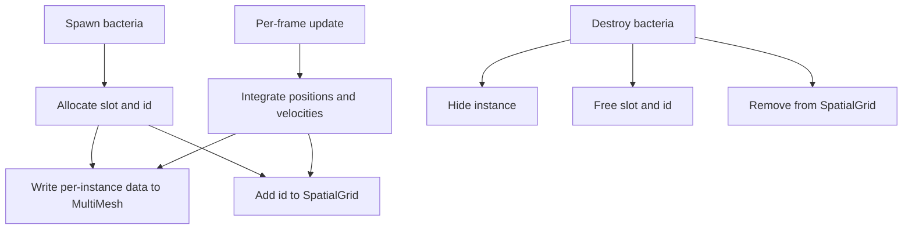

# Refactor: Replace per-entity nodes and pooling with MultiMeshInstance2D for bacteria

Status: implementation plan for coder agent

Objective
- Eliminate startup stall by removing bacteria node pooling and switching to a GPU-driven renderer that draws all bacteria in a single batch using MultiMeshInstance2D and a canvas_item shader.
- Decouple rendering from scene-tree nodes to scale to thousands of bacteria with stable frame times.

Scope
- Bacteria are fully migrated to GPU instanced rendering and array-based simulation data.
- Nutrients remain node-based initially; can be migrated later if needed.
- Existing spawning APIs remain stable at the call site. Internals change to stop creating Node2D scenes for bacteria.

Why this removes the stall
- The current stall is caused by mass instantiation during prewarm from [EntityFactory._ready()](scripts/systems/EntityFactory.gd:16) calling [ObjectPool.configure()](scripts/utils/ObjectPool.gd:9) synchronously.
- MultiMesh path eliminates both prewarming and per-entity nodes for bacteria, so there is no need to pre-instantiate or pool bacteria scenes at all.

Target architecture

- BacteriaRenderer (rendering)
  - Node: MultiMeshInstance2D
  - One draw call for all bacteria
  - Per-instance: transform_2d, color, custom data (size, shape_id)
  - Shader: interprets custom data to render circle/oval/spiky variants
- BacteriaStore (data)
  - Arrays: position, velocity, size, shape_id, color, alive flag
  - Mapping: entity_id ↔ slot_index
  - Free-list for fast reuse of dead slots
- BacteriaSystem (simulation)
  - Updates positions and velocities each frame
  - Emits spatial updates to SpatialGrid
  - Provides spawn and destroy operations in cooperation with Store and Renderer
- Integration with existing systems
  - SpatialGrid: keep as-is; call [SpatialGrid.add_entity()](scripts/systems/SpatialGrid.gd:67), [SpatialGrid.update_entity_position()](scripts/systems/SpatialGrid.gd:99), [SpatialGrid.remove_entity()](scripts/systems/SpatialGrid.gd:85)
  - EntityFactory: bacteria code path becomes index allocation and renderer update; stop instantiating scenes for bacteria in [EntityFactory._ready()](scripts/systems/EntityFactory.gd:16), [EntityFactory.create_entity()](scripts/systems/EntityFactory.gd:55), [EntityFactory.destroy_entity()](scripts/systems/EntityFactory.gd:91)
  - EntityRegistry: keep IDs for bacteria but store lightweight records instead of Node references for bacteria entries

Key decisions
- No pooling for bacteria. Remove prewarming entirely for bacteria type.
- Bacteria logic runs in a system over arrays. Node-based components are not created for bacteria.
- Nutrients continue using existing node pools until migrated.

Files to add

- scenes/renderers/BacteriaRenderer.tscn
  - Root node: MultiMeshInstance2D with script attached
- scripts/rendering/BacteriaRenderer.gd
  - extends MultiMeshInstance2D
  - API:
    - init(max_instances: int)
    - set_slot(index: int, pos: Vector2, color: Color, size: float, shape_id: int, rotation: float = 0.0)
    - hide_slot(index: int)  sets color.a = 0 or moves off-screen
    - commit()  optional batching commit if needed
- scripts/shaders/bacteria_shader.tres
  - canvas_item shader
  - Reads COLOR for tint, INSTANCE_CUSTOM.xy for size and shape_id
  - Draws signed-distance circle/oval/spiky from INSTANCE_CUSTOM
- scripts/systems/BacteriaStore.gd
  - class_name BacteriaStore
  - Signals: spawned(id: StringName, index: int), destroyed(id: StringName)
  - Methods:
    - allocate(params: Dictionary) -> Dictionary  returns {id, index}
    - free(id: StringName) -> void
    - get_index(id: StringName) -> int
    - foreach_alive(callback(index: int) -> void) iteration helper
- scripts/systems/BacteriaSystem.gd
  - Node that owns BacteriaStore and a reference to BacteriaRenderer and SpatialGrid
  - _ready: resolves renderer and SpatialGrid
  - spawn_bacteria(position, size, color, shape_id) -> StringName
  - despawn_bacteria(id: StringName)
  - _process(delta): updates positions and calls:
    - renderer.set_slot(index, new_pos, color, size, shape_id)
    - [SpatialGrid.update_entity_position()](scripts/systems/SpatialGrid.gd:99)

Configuration changes

- scripts/systems/ConfigurationManager.gd
  - Add runtime flags and params:
    - bacteria_render_mode: int (0 = node_based, 1 = multimesh) default 1
    - bacteria_max_instances: int default 10000
    - bacteria_default_radius: float default 4.0
    - bacteria_initial_count: int for initial spawn if needed
  - Mark bacteria entries in [ConfigurationManager.entity_pool_sizes](scripts/systems/ConfigurationManager.gd:26) as deprecated or ignored when multimesh is enabled.

Changes to existing code

- scripts/systems/EntityFactory.gd
  - In [EntityFactory._ready()](scripts/systems/EntityFactory.gd:16)
    - Do not create a pool for EntityTypes.BACTERIA
    - Resolve and cache a reference to BacteriaSystem (or its Store and Renderer)
  - In [EntityFactory.create_entity()](scripts/systems/EntityFactory.gd:55)
    - Branch on EntityTypes.BACTERIA:
      - Call BacteriaSystem.spawn_bacteria(position, params.size or cfg default, params.color or random, params.shape_id or 0)
      - Return the id from BacteriaSystem without creating or adding any Node
    - Non-bacteria path remains unchanged
  - In [EntityFactory.destroy_entity()](scripts/systems/EntityFactory.gd:91)
    - Branch on bacteria: call BacteriaSystem.despawn_bacteria(id) rather than pool.release
- scripts/utils/ObjectPool.gd
  - No changes required for launch as bacteria path no longer uses this; consider adding a comment deprecating bacteria pooling to avoid regressions
- scripts/systems/SpatialGrid.gd
  - No changes to API; ensure BacteriaSystem uses:
    - [add_entity](scripts/systems/SpatialGrid.gd:67) at spawn
    - [update_entity_position](scripts/systems/SpatialGrid.gd:99) during movement
    - [remove_entity](scripts/systems/SpatialGrid.gd:85) at despawn

Behavior and AI migration strategy

- Initial minimal behavior for bacteria in BacteriaSystem:
  - Random wander based on a simple velocity with jitter, respecting PetriDish bounds
  - Keep size, color, shape parameters; future behaviors can extend arrays
- Optional future port of behaviors from:
  - [RandomWander.gd](scripts/behaviors/RandomWander.gd)
  - [SeekNutrient.gd](scripts/behaviors/SeekNutrient.gd)
  - These will be converted to array-based updates in BacteriaSystem to avoid per-entity nodes

Data model and IDs

- IDs: Use StringName UUIDs similar to IdentityComponent previously created in [EntityFactory.create_entity()](scripts/systems/EntityFactory.gd:69); generate in BacteriaSystem on allocate
- Store:
  - Arrays: pos: PackedVector2Array, vel: PackedVector2Array, color: PackedColorArray, size: PackedFloat32Array, shape: PackedInt32Array, alive: PackedByteArray
  - Free list: PackedInt32Array of available indices
- Renderer:
  - MultiMesh.instance_count = bacteria_max_instances
  - Use set_instance_transform_2d(index, Transform2D(rotation, pos))
  - set_instance_color(index, color)
  - set_instance_custom_data(index, Vector4(size, shape_id, 0, 0))

Scene graph additions

- scenes/Main.tscn (or root of simulation scene) add a child:
  - Node: BacteriaRenderer (MultiMeshInstance2D)
  - Node: BacteriaSystem (script, no visual)
- Group BacteriaSystem into Systems group if you use it elsewhere

Shader outline

- Fragment draws shapes via SDF:
  - instance size: INSTANCE_CUSTOM.x
  - shape id: INSTANCE_CUSTOM.y
  - COLOR used for tint and alpha
- Shapes:
  - 0 circle, 1 oval, 2 spiky
- Support per-instance rotation using TRANSFORM or pass angle via custom data

Refactor steps for coder agent

1) Create files and scene
- Create BacteriaRenderer.tscn with MultiMeshInstance2D and attach scripts/rendering/BacteriaRenderer.gd
- Create scripts/shaders/bacteria_shader.tres canvas_item shader resource and assign to BacteriaRenderer material
- Create scripts/systems/BacteriaStore.gd and scripts/systems/BacteriaSystem.gd

2) Implement BacteriaRenderer.gd
- Methods:
  - init(max_instances): allocate MultiMesh, set use_custom_data = true
  - set_slot(index, pos, color, size, shape_id, rotation=0.0): update transform_2d, color, custom data
  - hide_slot(index): set color.a = 0 or position off-screen
- Optimize: batch commit if needed; otherwise direct setters are fine

3) Implement BacteriaStore.gd
- Manage arrays and free list
- allocate(params): returns {id, index}
- free(id): recycles index and clears renderer slot via hide_slot

4) Implement BacteriaSystem.gd
- On _ready:
  - get renderer node and SpatialGrid
  - call renderer.init(ConfigurationManager.bacteria_max_instances)
- spawn_bacteria(position, size, color, shape):
  - Allocate index and id in store
  - Initialize vel, size, color, shape
  - renderer.set_slot(index, position, ...)
  - [SpatialGrid.add_entity](scripts/systems/SpatialGrid.gd:67)(id, position, size, EntityTypes.EntityType.BACTERIA)
  - return id
- despawn_bacteria(id):
  - renderer.hide_slot(index)
  - [SpatialGrid.remove_entity](scripts/systems/SpatialGrid.gd:85)(id)
  - store.free(id)
- _process(delta):
  - simple wander: vel += jitter; pos += vel * delta; clamp to dish
  - renderer.set_slot(index, pos, ...)
  - [SpatialGrid.update_entity_position](scripts/systems/SpatialGrid.gd:99)(id, pos, size)

5) Update ConfigurationManager.gd
- Add bacteria_render_mode, bacteria_max_instances, bacteria_default_radius, bacteria_initial_count
- When bacteria_render_mode == 1, ignore bacteria entry in [ConfigurationManager.entity_pool_sizes](scripts/systems/ConfigurationManager.gd:26)

6) Update EntityFactory.gd
- In [EntityFactory._ready()](scripts/systems/EntityFactory.gd:16):
  - Skip creating a pool for EntityTypes.BACTERIA; do not call [ObjectPool.configure()](scripts/utils/ObjectPool.gd:9) for bacteria
  - Resolve BacteriaSystem reference and cache it
- In [EntityFactory.create_entity()](scripts/systems/EntityFactory.gd:55):
  - If entity_type == BACTERIA:
    - Use BacteriaSystem.spawn_bacteria(position, params.get(size, cfg), params.get(color, rng), params.get(shape_id, 0))
    - Return id; do not create Node, do not add SpatialTrackerComponent for bacteria
  - Else: existing path for non-bacteria unchanged
- In [EntityFactory.destroy_entity()](scripts/systems/EntityFactory.gd:91):
  - If bacteria: BacteriaSystem.despawn_bacteria(id); skip pool.release

7) Wiring in scene
- Add BacteriaRenderer and BacteriaSystem to scenes/Main.tscn or scenes/Game.tscn
- Ensure SpatialGrid is available as now
- Optionally add a minimal bootstrap to spawn ConfigurationManager.bacteria_initial_count bacteria on start

8) Logging and metrics
- Use Log.every via [Log.every()](scripts/systems/Log.gd:83) in BacteriaSystem to print:
  - active_count, updates/s, instance_count, free_slots
- Verify no frame stalls on startup; GPU instancing should keep frame time stable

9) Cleanup and guardrails
- Comment in [EntityFactory._ready()](scripts/systems/EntityFactory.gd:16) noting bacteria pooling is disabled under multimesh mode
- Optionally assert that bacteria pools are not configured when mode == multimesh
- Keep ObjectPool for other types; remove bacteria-specific pool sizes to avoid confusion

Acceptance criteria
- Launch has no multi-second stall with bacteria_initial_count at 2000+
- Frame time stable for first 5 seconds; no per-frame spikes due to instantiation
- Bacteria visible and moving; color, size, shape controlled per-instance via shader inputs
- Spatial queries against bacteria through SpatialGrid remain functional

Rollback plan
- Switch ConfigurationManager.bacteria_render_mode back to 0 to return to node-based bacteria (for debugging), if desired
- No structural changes to Nutrients in this refactor

Mermaid overview

Notes for shader authoring
- Keep the base texture a white circle or use pure procedural SDF
- Use INSTANCE_CUSTOM.xy for size and shape; pack rotation or other attributes if needed
- Respect COLOR alpha to hide dead instances cheaply

Risks and mitigations
- Missing behaviors from node-based components: implement minimal wander now, port specific behaviors iteratively
- SpatialGrid sync: ensure BacteriaSystem is the single writer to SpatialGrid for bacteria to avoid double registration
- Resource lifetime: ensure MultiMesh.instance_count covers peak; add simple guard to avoid overflow

Definition of done
- Bacteria are rendered via MultiMesh with shader control, no pooling or bacteria scene instantiation occurs at startup
- Startup stall eliminated
- EntityFactory and spatial queries remain stable for non-bacteria entities