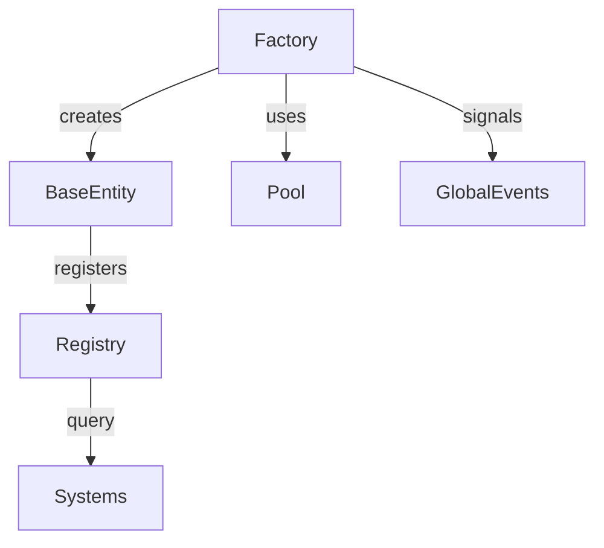

# Phase 1.2 — Base Entity System (Coder AI Instruction Pack)

Purpose: implement BaseEntity scene, component interfaces, registry, factory, pooling, and lifecycle signals to support spawning and management of entities in Godot 4.5.

Deliverables
- scenes/entities/BaseEntity.tscn with Area2D root and CollisionShape2D child
- scripts/components/EntityComponent.gd base interface
- scripts/components/IdentityComponent.gd with UUID and type
- scripts/components/PhysicalComponent.gd with transform sync
- scripts/components/BaseEntity.gd managing components and lifecycle
- scripts/components/EntityTypes.gd enum/type registry
- scripts/systems/EntityRegistry.gd autoload
- scripts/utils/ObjectPool.gd generic pool
- scripts/systems/EntityFactory.gd autoload
- Updated scripts/systems/GlobalEvents.gd signals for entity lifecycle
- Configuration for per-type pool sizes via scripts/systems/ConfigurationManager.gd

Acceptance Criteria
- Able to spawn and destroy entities via EntityFactory without leaks
- EntityRegistry tracks entities by id and type; counts are accurate
- Pooling reuses instances when creating and destroying repeatedly
- entity_spawned and entity_destroyed signals fire with correct payloads
- BaseEntity forwards _process to components; PhysicalComponent keeps Area2D transform in sync
- No errors or warnings in Output during spawn/despawn test of 100 cycles

Implementation Plan Overview
1. Define type system and base interfaces
2. Build BaseEntity scene and script
3. Implement Identity and Physical components
4. Add GlobalEvents lifecycle signals
5. Implement EntityRegistry as autoload
6. Implement ObjectPool utility
7. Implement EntityFactory as autoload using pools and registry
8. Wire default pool sizes in ConfigurationManager
9. Create a temporary DebugSpawner for verification

File and Scene Contracts

1) scenes/entities/BaseEntity.tscn
- Root: Area2D name: BaseEntity
- Children:
  - CollisionShape2D name: Collider (use CircleShape2D radius 8 as placeholder)
  - Node name: Components (container for component scripts)
- Default collision_layer = 1, collision_mask = 1

2) scripts/components/EntityComponent.gd
- GDScript abstract base with methods:
  - func init(entity: Node) -> void
  - func update(delta: float) -> void
  - func cleanup() -> void

3) scripts/components/IdentityComponent.gd
- Stores uuid: StringName, entity_type: int
- On init, generates UUID if missing

4) scripts/components/PhysicalComponent.gd
- Stores position: Vector2, rotation: float, size: float, mass: float
- On update, syncs owner Area2D transform from fields

5) scripts/components/BaseEntity.gd
- Attached to BaseEntity.tscn root
- Exports:
  - entity_type: int
  - size: float = 8.0
- Signals:
  - ready_for_pool()
- Methods:
  - func add_component(comp: EntityComponent) -> void
  - func init(params := {}) -> void
  - func deinit() -> void
  - func _process(delta) forwards to components

6) scripts/components/EntityTypes.gd
- enum EntityType { UNKNOWN = 0, BACTERIA = 1, NUTRIENT = 2, AMOEBA = 3, VIRUS = 4 }

7) scripts/systems/GlobalEvents.gd additions
- Add signals:
  - signal entity_spawned(entity_id: StringName, entity_type: int, position: Vector2)
  - signal entity_destroyed(entity_id: StringName, entity_type: int, reason: StringName)

8) scripts/systems/EntityRegistry.gd (autoload)
- API:
  - func add(id: StringName, entity: Node, entity_type: int) -> void
  - func remove(id: StringName) -> void
  - func get_by_id(id: StringName) -> Node
  - func get_all_by_type(entity_type: int) -> Array
  - func count_by_type(entity_type: int) -> int
- Internals: _by_id: Dictionary, _by_type: Dictionary<int, Array>

9) scripts/utils/ObjectPool.gd
- Generic pool for Node instances
- API:
  - func configure(scene_path: String, prewarm_count: int) -> void
  - func acquire() -> Node
  - func release(node: Node) -> void
- Keep inactive nodes under a dedicated PoolContainer Node

10) scripts/systems/EntityFactory.gd (autoload)
- Dependencies: EntityRegistry, GlobalEvents, ConfigurationManager, ObjectPool
- API:
  - func create_entity(entity_type: int, position: Vector2, params := {}) -> StringName
  - func destroy_entity(entity_id: StringName, reason: StringName = &"despawn") -> void
- Internals: one ObjectPool per entity_type; attaches BaseEntity to scene tree under Game/DishContainer

11) Configuration
- Add default pool sizes to ConfigurationManager.gd:
  - var entity_pool_sizes := { EntityTypes.EntityType.BACTERIA: 50, EntityTypes.EntityType.NUTRIENT: 200 }

Implementation Details and Templates

A) scripts/components/EntityComponent.gd
```gdscript
extends Node
class_name EntityComponent

func init(entity: Node) -> void:
    pass

func update(delta: float) -> void:
    pass

func cleanup() -> void:
    pass
```

B) scripts/components/IdentityComponent.gd
```gdscript
extends EntityComponent
class_name IdentityComponent

var uuid: StringName
var entity_type: int = 0

func init(entity: Node) -> void:
    if uuid.is_empty():
        uuid = StringName(UUID.new_uuid().to_string())
```

C) scripts/components/EntityTypes.gd
```gdscript
extends Node
class_name EntityTypes

enum EntityType { UNKNOWN = 0, BACTERIA = 1, NUTRIENT = 2, AMOEBA = 3, VIRUS = 4 }
```

D) scripts/components/PhysicalComponent.gd
```gdscript
extends EntityComponent
class_name PhysicalComponent

var position: Vector2 = Vector2.ZERO
var rotation: float = 0.0
var size: float = 8.0
var mass: float = 1.0
var _owner_area: Area2D

func init(entity: Node) -> void:
    _owner_area = entity as Area2D
    if _owner_area:
        position = _owner_area.global_position
        rotation = _owner_area.rotation

func update(delta: float) -> void:
    if _owner_area:
        _owner_area.global_position = position
        _owner_area.rotation = rotation
        var collider := _owner_area.get_node_or_null("Collider") as CollisionShape2D
        if collider and collider.shape is CircleShape2D:
            (collider.shape as CircleShape2D).radius = size

func cleanup() -> void:
    _owner_area = null
```

E) scripts/components/BaseEntity.gd
```gdscript
extends Area2D
class_name BaseEntity

@export var entity_type: int = 0
@export var size: float = 8.0

var _components: Array[EntityComponent] = []
var identity: IdentityComponent
var physical: PhysicalComponent

func _ready() -> void:
    # Attach default components
    identity = IdentityComponent.new()
    add_component(identity)
    physical = PhysicalComponent.new()
    add_component(physical)
    physical.size = size

func add_component(comp: EntityComponent) -> void:
    _components.append(comp)
    comp.init(self)

func init(params := {}) -> void:
    if params.has("position"):
        physical.position = params["position"]

func deinit() -> void:
    for c in _components:
        c.cleanup()
    _components.clear()

func _process(delta: float) -> void:
    for c in _components:
        c.update(delta)
```

F) scripts/systems/GlobalEvents.gd additions
Add at top-level with existing signals:
```gdscript
signal entity_spawned(entity_id: StringName, entity_type: int, position: Vector2)
signal entity_destroyed(entity_id: StringName, entity_type: int, reason: StringName)
```

G) scripts/systems/EntityRegistry.gd
```gdscript
extends Node

var _by_id: Dictionary = {}
var _by_type: Dictionary = {}

func add(id: StringName, entity: Node, entity_type: int) -> void:
    _by_id[id] = entity
    if not _by_type.has(entity_type):
        _by_type[entity_type] = []
    _by_type[entity_type].append(entity)

func remove(id: StringName) -> void:
    if not _by_id.has(id):
        return
    var ent = _by_id[id]
    _by_id.erase(id)
    for t in _by_type.keys():
        _by_type[t].erase(ent)

func get_by_id(id: StringName) -> Node:
    return _by_id.get(id, null)

func get_all_by_type(entity_type: int) -> Array:
    return _by_type.get(entity_type, [])

func count_by_type(entity_type: int) -> int:
    return get_all_by_type(entity_type).size()
```

H) scripts/utils/ObjectPool.gd
```gdscript
extends Node
class_name ObjectPool

var _scene: PackedScene
var _available: Array[Node] = []
var _in_use: Array[Node] = []
var _container: Node

func configure(scene_path: String, prewarm_count: int, container: Node) -> void:
    _scene = load(scene_path)
    _container = container
    for i in prewarm_count:
        var n: Node = _scene.instantiate()
        n.visible = false
        _container.add_child(n)
        _available.append(n)

func acquire() -> Node:
    var n: Node = _available.is_empty() ? _scene.instantiate() : _available.pop_back()
    _in_use.append(n)
    n.visible = true
    return n

func release(n: Node) -> void:
    if n in _in_use:
        _in_use.erase(n)
    n.visible = false
    _available.append(n)
```

I) scripts/systems/EntityFactory.gd
```gdscript
extends Node

const BASE_ENTITY_SCENE := "res://scenes/entities/BaseEntity.tscn"

var _pools: Dictionary = {}
var _root_parent: Node

func _ready() -> void:
    # Find Game/DishContainer or fallback to scene root
    _root_parent = get_tree().root.find_node("DishContainer", true, false)
    if _root_parent == null:
        _root_parent = get_tree().root
    # Ensure a PoolContainer exists
    var pool_container := Node.new()
    pool_container.name = "PoolContainer"
    add_child(pool_container)
    # Configure default pool for base entity
    var pool := ObjectPool.new()
    add_child(pool)
    pool.configure(BASE_ENTITY_SCENE, 50, pool_container)
    _pools[0] = pool

func create_entity(entity_type: int, position: Vector2, params := {}) -> StringName:
    var pool: ObjectPool = _pools.get(entity_type, _pools[0])
    var node := pool.acquire() as BaseEntity
    if node:
        _root_parent.add_child(node)
        node.entity_type = entity_type
        node.init({ "position": position } | params)
        var id := node.identity.uuid
        EntityRegistry.add(id, node, entity_type)
        GlobalEvents.emit_signal("entity_spawned", id, entity_type, position)
        return id
    return StringName()

func destroy_entity(entity_id: StringName, reason: StringName = &"despawn") -> void:
    var node := EntityRegistry.get_by_id(entity_id) as BaseEntity
    if not node:
        return
    node.deinit()
    GlobalEvents.emit_signal("entity_destroyed", entity_id, node.entity_type, reason)
    EntityRegistry.remove(entity_id)
    # Return to pool
    for pool in _pools.values():
        if node.get_parent() != null:
            node.get_parent().remove_child(node)
        pool.release(node)
        break
```

J) Temporary DebugSpawner for verification
- Create scripts/systems/DebugSpawner.gd and attach to scenes/Game.tscn → SystemsContainer as a child node.
- Behavior:
  - On _ready: spawn 10 entities at random positions within dish radius
  - After 2 seconds, destroy them
- Remove this node before committing Phase 1.3

Editor and Autoload Steps
- Project Settings → Autoload: add EntityRegistry.gd and EntityFactory.gd with names EntityRegistry and EntityFactory
- Ensure GlobalEvents has new signals and no duplicate names

Verification Procedure
1. Run project
2. Observe Output prints for GlobalEvents, WorldState, ConfigurationManager; ensure no errors
3. Confirm 10 entities appear and then are destroyed; observe entity_spawned and entity_destroyed signals if logged
4. Verify EntityRegistry.count_by_type returns expected counts during test
5. Repeat spawn/despawn loop 10 times; ensure instance count in remote tree does not grow unbounded (pooling works)

Mapping to Phase 1.2 Checklist
- Create BaseEntity scene with Area2D root and CollisionShape2D child → Delivered
- Implement EntityComponent base class with init(), update(), cleanup() → Delivered
- Create IdentityComponent with UUID and entity type → Delivered
- Implement PhysicalComponent with position, rotation, size, mass → Delivered
- Create EntityFactory singleton with create_entity() → Delivered
- Implement EntityRegistry with add(), remove(), get_by_id() → Delivered
- Create entity pooling system with configurable pool sizes → Delivered
- Add entity lifecycle signals: entity_spawned, entity_destroyed → Delivered

Mermaid System Diagram


Commit Guidance
- Commit message: feat(ems): add BaseEntity, components, registry, factory, pooling and lifecycle signals for Phase 1.2

Handoff
After acceptance, proceed to Phase 1.3 Petri Dish Environment for collision integration and boundary interactions.