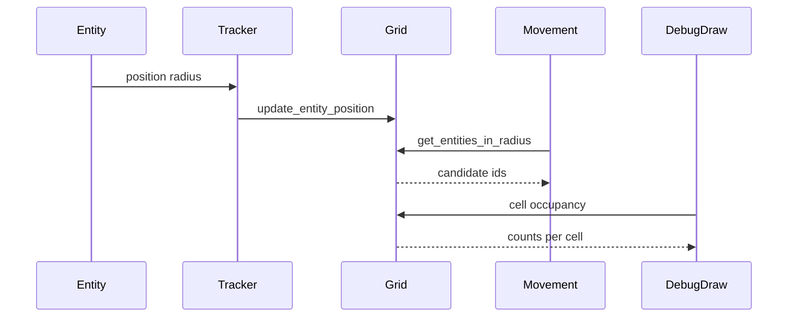

# Phase 1.5 - Spatial Partitioning System (Godot 4.5)
This file instructs the Code AI agent to implement an efficient spatial grid for neighbor queries and broad-phase culling, aligned with Phase 1.5 of the plan. It integrates with existing systems and Godot 4.5.

Scope and acceptance criteria
- Implement a spatial grid with configurable cell size sourced from [scripts/systems/ConfigurationManager.gd](scripts/systems/ConfigurationManager.gd).
- Provide APIs: [GDScript.SpatialGrid.add_entity(entity_id: StringName, position: Vector2, radius: float)](scripts/systems/SpatialGrid.gd:1), [GDScript.SpatialGrid.remove_entity(entity_id: StringName)](scripts/systems/SpatialGrid.gd:1), [GDScript.SpatialGrid.update_entity_position(entity_id: StringName, position: Vector2, radius: float)](scripts/systems/SpatialGrid.gd:1), [GDScript.SpatialGrid.get_entities_in_cell(cell: Vector2i)](scripts/systems/SpatialGrid.gd:1), [GDScript.SpatialGrid.get_entities_in_radius(center_world: Vector2, radius: float, type_mask: Array = [])](scripts/systems/SpatialGrid.gd:1).
- Track entity positions and automatically update occupied cells when entities move.
- Neighbor queries must consider only adjacent cells when possible to reduce cost.
- Provide debug visualization of grid cells and occupancy integrated with [scripts/environments/PetriDishDebugDraw.gd](scripts/environments/PetriDishDebugDraw.gd).
- Collect performance metrics for spatial queries and updates; expose counters accessible via [scripts/systems/WorldState.gd](scripts/systems/WorldState.gd) or directly on SpatialGrid.
- Maintain compatibility with the current movement and dish systems: [scripts/components/MovementComponent.gd](scripts/components/MovementComponent.gd), [scripts/environments/PetriDish.gd](scripts/environments/PetriDish.gd).

Architecture and integration
- Implement [scripts/systems/SpatialGrid.gd](scripts/systems/SpatialGrid.gd) as a Node attached under SystemsContainer in the main scene. Name the instance SpatialGrid and add it to a group "Spatial".
- Introduce [scripts/components/SpatialTrackerComponent.gd](scripts/components/SpatialTrackerComponent.gd) that attaches to each [scripts/components/BaseEntity.gd](scripts/components/BaseEntity.gd) and pushes position updates to SpatialGrid every frame, pulling size from [scripts/components/PhysicalComponent.gd](scripts/components/PhysicalComponent.gd).
- Modify [GDScript.MovementComponent._compute_separation_accel()](scripts/components/MovementComponent.gd:107) to optionally use SpatialGrid to fetch neighbor candidates via [GDScript.SpatialGrid.get_entities_in_radius()](scripts/systems/SpatialGrid.gd:1) when available; retain current Area2D overlap fallback for safety.
- Reuse grid line rendering already present in [scripts/environments/PetriDishDebugDraw.gd](scripts/environments/PetriDishDebugDraw.gd:1). Add optional overlays: heatmap intensity per cell and per-cell counts.

Public API specification
- [GDScript.SpatialGrid.configure(cell_size: float, dish: PetriDish)](scripts/systems/SpatialGrid.gd:1)
  - Call from PetriDish._ready using [scripts/environments/PetriDish.gd](scripts/environments/PetriDish.gd) radius and [scripts/systems/ConfigurationManager.gd](scripts/systems/ConfigurationManager.gd) grid_cell_size.
- [GDScript.SpatialGrid.add_entity(entity_id: StringName, position: Vector2, radius: float, entity_type: int = 0)](scripts/systems/SpatialGrid.gd:1)
- [GDScript.SpatialGrid.remove_entity(entity_id: StringName)](scripts/systems/SpatialGrid.gd:1)
- [GDScript.SpatialGrid.update_entity_position(entity_id: StringName, position: Vector2, radius: float)](scripts/systems/SpatialGrid.gd:1)
- [GDScript.SpatialGrid.get_entities_in_cell(cell: Vector2i) &#45;> Array[StringName]](scripts/systems/SpatialGrid.gd:1)
- [GDScript.SpatialGrid.get_entities_in_adjacent_cells(cell: Vector2i) &#45;> Array[StringName]](scripts/systems/SpatialGrid.gd:1)
- [GDScript.SpatialGrid.get_entities_in_radius(center_world: Vector2, radius: float, type_filter: Array = []) &#45;> Array[StringName]](scripts/systems/SpatialGrid.gd:1)
- [GDScript.SpatialGrid.get_cell_at_world(p_world: Vector2) &#45;> Vector2i](scripts/systems/SpatialGrid.gd:1)
- [GDScript.SpatialGrid.get_cell_bounds(cell: Vector2i) &#45;> Rect2](scripts/systems/SpatialGrid.gd:1)
- [GDScript.SpatialGrid.get_cell_size() &#45;> float](scripts/systems/SpatialGrid.gd:1)
- [GDScript.SpatialGrid.get_metrics() &#45;> Dictionary](scripts/systems/SpatialGrid.gd:1) with fields: updates, queries, total_update_time_us, total_query_time_us, max_update_time_us, max_query_time_us.

Data structures and algorithms
- Cells: Dictionary keyed by Vector2i &#45;> PackedStringArray of entity_ids. Prefer StringName to minimize allocations.
- Backrefs: Dictionary entity_id &#45;> { cells: PackedVector2Array of cell coords, position: Vector2, radius: float, type: int }.
- Coordinate mapping: Use dish-local coordinates from [GDScript.PetriDish.world_to_dish()](scripts/environments/PetriDish.gd:98). Cell index = floor((p_local.x + radius) / cell_size) &#45; half_width, but simpler and stable is to define grid origin at dish center: cell.x = floor(p_local.x / cell_size), cell.y = floor(p_local.y / cell_size).
- Multi-cell coverage: Compute min/max cell indices from AABB around the circle position ± radius, then insert into all intersecting cells. For entity removal or movement, compute previous occupied cells and reconcile differences to avoid full clears.
- Radius queries: Determine cell ring covering [center_world, radius + max_entity_radius_in_cells], iterate only those cells, and filter by exact distance check using positions from [scripts/components/PhysicalComponent.gd](scripts/components/PhysicalComponent.gd).
- Dish bounds: Ignore cells whose centers lie outside the dish radius when enumerating; alternatively check positions against [GDScript.PetriDish.is_inside_dish()](scripts/environments/PetriDish.gd:61) before returning results.

Update flow
- On spawn in [GDScript.EntityFactory.create_entity()](scripts/systems/EntityFactory.gd:42), after the entity enters the tree and [GDScript.BaseEntity.identity](scripts/components/BaseEntity.gd:11) is initialized, ensure the entity has a SpatialTrackerComponent and call [GDScript.SpatialGrid.add_entity()](scripts/systems/SpatialGrid.gd:1) with current position and size.
- Every frame, [GDScript.SpatialTrackerComponent.update()](scripts/components/SpatialTrackerComponent.gd:1) compares last position/radius with current [GDScript.PhysicalComponent](scripts/components/PhysicalComponent.gd:1). If changed enough to cross cell boundary or radius change, call [GDScript.SpatialGrid.update_entity_position()](scripts/systems/SpatialGrid.gd:1).
- On destruction in [GDScript.EntityFactory.destroy_entity()](scripts/systems/EntityFactory.gd:69), call [GDScript.SpatialGrid.remove_entity()](scripts/systems/SpatialGrid.gd:1).

Debug visualization
- Extend [scripts/environments/PetriDishDebugDraw.gd](scripts/environments/PetriDishDebugDraw.gd:1):
  - Add exports show_cell_counts: bool, show_heatmap: bool.
  - When drawing grid lines, if SpatialGrid exists, query occupancy per visible cell using [GDScript.SpatialGrid.get_entities_in_cell()](scripts/systems/SpatialGrid.gd:1).
  - Draw cell count as small text near cell center when show_cell_counts is true.
  - Draw translucent rect fill with alpha based on occupancy when show_heatmap is true.
- Keep drawing clipped to the circular dish as currently implemented.

Performance metrics
- In SpatialGrid, wrap updates and query methods with timing via [GDScript.Time.get_ticks_usec()](project.godot:1) and accumulate counters exposed via [GDScript.SpatialGrid.get_metrics()](scripts/systems/SpatialGrid.gd:1).
- Optionally mirror high-level counters into [scripts/systems/WorldState.gd](scripts/systems/WorldState.gd:1) each second for HUD display later.

Implementation tasks for Code AI
1) Create [scripts/systems/SpatialGrid.gd](scripts/systems/SpatialGrid.gd) implementing the API above. Add it to SystemsContainer in the main scene and add to group Spatial. Call configure in _ready by locating [GDScript.PetriDish](scripts/environments/PetriDish.gd:1).
2) Create [scripts/components/SpatialTrackerComponent.gd](scripts/components/SpatialTrackerComponent.gd). On init, cache BaseEntity.identity and PhysicalComponent. On update, call SpatialGrid API. Provide cleanup to deregister safely.
3) Integrate with [scripts/systems/EntityFactory.gd](scripts/systems/EntityFactory.gd:1): ensure spawned entities include SpatialTrackerComponent and that [GDScript.SpatialGrid.add_entity()](scripts/systems/SpatialGrid.gd:1) is called once after identity is valid.
4) Update [scripts/components/MovementComponent.gd](scripts/components/MovementComponent.gd:1): add export use_spatial_grid: bool = true and modify [GDScript.MovementComponent._compute_separation_accel()](scripts/components/MovementComponent.gd:107) to use SpatialGrid.get_entities_in_radius when available, with a small radius = physical.size * 2.0 or derived from separation parameters; retain fallback to get_overlapping_areas when grid is missing.
5) Extend [scripts/environments/PetriDishDebugDraw.gd](scripts/environments/PetriDishDebugDraw.gd:1) with optional occupancy overlays driven by SpatialGrid.
6) Record performance metrics in SpatialGrid and expose via get_metrics. Add a debug print each 5 seconds summarizing updates/sec, queries/sec, avg_us.
7) Add configuration knobs in [scripts/systems/ConfigurationManager.gd](scripts/systems/ConfigurationManager.gd:1): grid_cell_size already exists; add grid_debug_heatmap_default: bool = false, grid_debug_counts_default: bool = false if helpful.

Testing plan
- Unit-like checks in-game:
  - Spawn 100 entities randomly using [GDScript.EntityFactory.create_entity_random()](scripts/systems/EntityFactory.gd:92). Confirm sum of per-cell counts equals total active tracked entities.
  - Move a single entity across a cell boundary; verify its id disappears from old cell and appears in new cell.
  - Call [GDScript.SpatialGrid.get_entities_in_radius()](scripts/systems/SpatialGrid.gd:1) at a known point and validate results by cross-checking distances using [GDScript.PhysicalComponent.position](scripts/components/PhysicalComponent.gd:4).
  - Stress test: 500 entities moving; ensure avg query time per frame remains low and frame rate holds near 60 fps.
- Visual checks:
  - Toggle heatmap and counts; ensure values change as entities move and remain clipped to dish.
- Regression safety:
  - With grid disabled or missing, MovementComponent should still function via Area2D overlaps.

Open decisions and recommended answers
- Where to host SpatialGrid?
  - Recommended: Autoload singleton for global access; acceptable as the game guarantees a single dish.
- Where to store performance metrics?
  - Recommended: Inside SpatialGrid with get_metrics; optionally mirrored to [scripts/systems/WorldState.gd](scripts/systems/WorldState.gd) for global dashboards.
- Which component triggers automatic updates?
  - Recommended: New [scripts/components/SpatialTrackerComponent.gd](scripts/components/SpatialTrackerComponent.gd) for isolation.
- Query API return type?
  - Recommended: Array[StringName] entity ids; callers can resolve to nodes via [GDScript.EntityRegistry.get_by_id()](scripts/systems/EntityRegistry.gd:20) and optionally filter by type.

Mermaid overview

References to existing code
- Dish and boundary utilities: [scripts/environments/PetriDish.gd](scripts/environments/PetriDish.gd)
- Debug grid drawing base: [scripts/environments/PetriDishDebugDraw.gd](scripts/environments/PetriDishDebugDraw.gd:1)
- Movement system: [scripts/components/MovementComponent.gd](scripts/components/MovementComponent.gd:1)
- Base entity and physical: [scripts/components/BaseEntity.gd](scripts/components/BaseEntity.gd), [scripts/components/PhysicalComponent.gd](scripts/components/PhysicalComponent.gd:1)
- Entity registry and factory: [scripts/systems/EntityRegistry.gd](scripts/systems/EntityRegistry.gd:1), [scripts/systems/EntityFactory.gd](scripts/systems/EntityFactory.gd:1)
- Configuration: [scripts/systems/ConfigurationManager.gd](scripts/systems/ConfigurationManager.gd:1)

Mapping to PHASE 1.5 checklist
- SpatialGrid class with configurable cell size → Implemented by [scripts/systems/SpatialGrid.gd](scripts/systems/SpatialGrid.gd) using ConfigurationManager.grid_cell_size.
- Methods add_entity, remove_entity, update_entity_position → Provided by SpatialGrid API.
- get_entities_in_cell and get_entities_in_radius → Provided by SpatialGrid API.
- Entity position tracking with automatic cell updates → Implemented by [scripts/components/SpatialTrackerComponent.gd](scripts/components/SpatialTrackerComponent.gd) calling SpatialGrid.
- Neighbor query optimization using adjacent cells only → Implemented in get_entities_in_radius and used by MovementComponent.
- Debug visualization for grid cells and entity distribution → Implemented by extending [scripts/environments/PetriDishDebugDraw.gd](scripts/environments/PetriDishDebugDraw.gd:1).
- Performance metrics for spatial query times → Implemented within SpatialGrid.get_metrics with optional mirroring to WorldState.