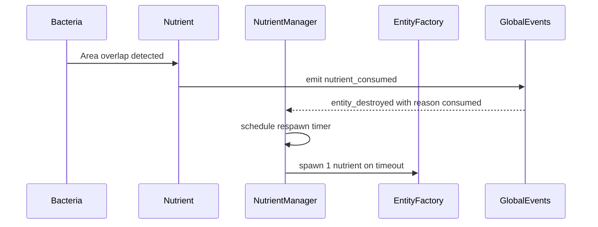

# Codebase Review and Alignment Analysis — Petri Pandemonium

Summary of findings after reviewing the current Godot 4.5 project, focused on alignment with proposal, architecture, and Phase 2.1 Nutrient System. The game runs with autonomous entities and nutrients; foundations are strong and expandable.

Status versus planning documents

- Proposal and scope: On track for MVP core. Foundations for EMS, PSS, RMS are present.
- System architecture: Layered design is emerging. EMS, PSS, RMS, UIS stubs in place; BCS and EBS are partial. Data layer uses components but resources folder pending.
- Phased plan: Phase 1 largely complete; Phase 2.1 Nutrient System implemented and operational.

Evidence from code review

- Entities and components
  - Base entity and component model implemented in [scripts/components/BaseEntity.gd](scripts/components/BaseEntity.gd) with default components attached in [BaseEntity._ready()](scripts/components/BaseEntity.gd:15) and ad hoc component discovery under Components.
  - Identity handled in [IdentityComponent.init()](scripts/components/IdentityComponent.gd:20) with UUID generation in [IdentityComponent._generate_uuid()](scripts/components/IdentityComponent.gd:7).
  - Physical state synchronized in [PhysicalComponent.update()](scripts/components/PhysicalComponent.gd:16).
- Movement and behaviors
  - Velocity based integration, damping, jitter, separation, and boundary resolution in [MovementComponent.update()](scripts/components/MovementComponent.gd:49) with dish interaction via [PetriDish.resolve_boundary_collision()](scripts/environments/PetriDish.gd:74).
  - Simple wandering behavior in [RandomWander.update()](scripts/behaviors/RandomWander.gd:23) influencing acceleration on the movement component.
- Spatial systems
  - Spatial partitioning with metrics in [SpatialGrid](scripts/systems/SpatialGrid.gd) and entity registration via [SpatialTrackerComponent](scripts/components/SpatialTrackerComponent.gd). Grid queries used for neighbor separation in [MovementComponent._compute_separation_accel()](scripts/components/MovementComponent.gd:136).
- Entity lifecycle and pooling
  - Object pooling in [ObjectPool](scripts/utils/ObjectPool.gd) and typed spawning in [EntityFactory.create_entity()](scripts/systems/EntityFactory.gd:52), with automatic SpatialTracker attach and registry updates.
  - Registry lookups and type lists in [EntityRegistry](scripts/systems/EntityRegistry.gd).
- Nutrient system (Phase 2.1)
  - Spawning modes Random, Clustered, Uniform via [NutrientManager._spawn_now()](scripts/systems/NutrientManager.gd:111), [._spawn_random()](scripts/systems/NutrientManager.gd:125), [._spawn_clustered()](scripts/systems/NutrientManager.gd:132), [._spawn_uniform()](scripts/systems/NutrientManager.gd:149).
  - Consumption detection and visual tween in [NutrientComponent._on_area_entered()](scripts/components/NutrientComponent.gd:43) and [._on_consume_tween_finished()](scripts/components/NutrientComponent.gd:81), with respawn scheduling in [NutrientManager._on_entity_destroyed()](scripts/systems/NutrientManager.gd:97).
  - Scene hookup in [scenes/entities/Nutrient.tscn](scenes/entities/Nutrient.tscn) and project autoloads in [project.godot](project.godot).

Assessment against architecture

- EMS: Factory, Pool, Registry implemented; entity scene mapping via [ConfigurationManager.entity_scene_paths](scripts/systems/ConfigurationManager.gd:31). Suggest adding EntityLifecycleManager style wrapper around deinit paths.
- BCS: Basic behavior via components; State machine and utility scoring not yet present. Recommend adding State base and controller next.
- PSS: Custom movement plus grid neighbor queries. Broad phase via grid is good; collisions are handled kinematically against dish.
- RMS: Nutrients implemented; EnergyProcessor and environment controller pending.
- EBS: GlobalEvents serves as a lightweight event bus; typed event payloads exist but no priority or history.
- UIS: HUD exists but minimal; no stats plotted yet.
- Data Layer: Components act as state; resource-backed templates not yet added.

Performance review and risks

- Per-entity drawing: [BaseEntity._draw()](scripts/components/BaseEntity.gd:96) draws circles every frame and calls queue_redraw in [BaseEntity._process()](scripts/components/BaseEntity.gd:91). At 500+ entities this may be a bottleneck. Consider MultiMeshInstance2D for homogeneous visuals, or at least conditional redraws when size or color changes.
- Spatial updates frequency: [SpatialTrackerComponent.update()](scripts/components/SpatialTrackerComponent.gd:27) calls grid update even for small motion. Introduce a minimum distance threshold and update budgeting tiers to reduce churn.
- Separation query cost: [MovementComponent._compute_separation_accel()](scripts/components/MovementComponent.gd:136) performs EntityRegistry lookups per neighbor. Consider storing small structs in grid cells with cached PhysicalComponent refs or instance_ids to avoid dictionary and tree traversals, while guarding against invalid instances.
- Logging volume: [SpatialGrid._process()](scripts/systems/SpatialGrid.gd:33) prints metrics every 5s; [NutrientManager] debug_logging true by default. Gate with a global debug flag and make logs opt in.
- Pooling completeness: Ensure all components fully reset in cleanup; current patterns look sound.

Functional risks and correctness

- Area2D collision reliance: Nutrient consumption uses Area2D overlap; ensure monitoring is enabled on all entities and that bacteria have collision shapes sized to their PhysicalComponent to avoid misses.
- Identity availability: Factory ensures IdentityComponent exists before init in [EntityFactory.create_entity()](scripts/systems/EntityFactory.gd:65); good for preventing missing IDs in SpatialTracker.
- Registry consistency: [EntityRegistry.remove()](scripts/systems/EntityRegistry.gd:12) erases entity from all type arrays by iteration; correct but O(types). For scale consider a _id_to_type map for O(1) removal.

Recommended next steps aligned to phased plan

1) Phase 2.2 Bacteria
   - Create Bacteria scene with BaseEntity root; attach [MovementComponent](scripts/components/MovementComponent.gd) and placeholder BiologicalComponent tracking energy, age, health.
   - Implement SeekNutrient behavior using [SpatialGrid.get_entities_in_radius()](scripts/systems/SpatialGrid.gd:132) and filter by nutrient type.
   - Add metabolism tick and simple reproduction when energy threshold reached.
2) Phase 2.3 State machine
   - Implement State and StateMachine base with enter, update, exit; integrate with bacteria states Idle, Seeking, Feeding, Reproducing, Dying.
3) RMS energy unification
   - Introduce EnergyProcessor to centralize energy gain on consumption and metabolism decay; emit typed events on thresholds.
4) EBS enhancements
   - Replace or wrap GlobalEvents with an EventBus supporting priorities and history buffer; start with simple typed dispatch and opt in logging.
5) UI stats
   - Add population counts and nutrient active count to [HUD](scenes/ui/HUD.tscn). Hook via GlobalEvents and periodic queries to [EntityRegistry](scripts/systems/EntityRegistry.gd).
6) Performance toggles
   - Add ConfigurationManager flags for spatial and nutrient logs; disable by default in release.
7) Resources folder
   - Create resources subfolders and add OrganismTemplates; move numeric defaults from [ConfigurationManager](scripts/systems/ConfigurationManager.gd) into Resources where appropriate.
8) Testing
   - Add GUT tests for [PetriDish.resolve_boundary_collision()](scripts/environments/PetriDish.gd:74) and [SpatialGrid._compute_covering_cells()](scripts/systems/SpatialGrid.gd:208).
9) Visual consistency
   - Ensure collider radius tracks PhysicalComponent.size for all entities; current [PhysicalComponent.update()](scripts/components/PhysicalComponent.gd:16) handles this.
10) Update budgeting
   - Implement a simple Tier system now: e.g., update MovementComponent every frame but compute separation every 2 to 3 frames per entity based on distance from camera center.

Quick wins to apply immediately

- Turn off default debug logging: set [NutrientManager.debug_logging](scripts/systems/NutrientManager.gd:21) false and add a ConfigurationManager toggle.
- Reduce log spam from [SpatialGrid._process()](scripts/systems/SpatialGrid.gd:33) behind a flag; expose in project settings for fast switch.
- Add minimum movement threshold in [SpatialTrackerComponent.update()](scripts/components/SpatialTrackerComponent.gd:27) before calling update_entity_position, e.g., only when moved > 1 to 2 px or every N frames.

Suggested minimal state machine API sketch

- State: enter(entity), update(entity, delta), exit(entity)
- StateMachine: push(state), pop(), set(state), update(delta)
- Example transitions: energy low → Seeking; near nutrient → Feeding; energy ≥ threshold → Reproducing.

Mermaid: nutrient consumption event flow

Overall verdict

Foundations are solid and align with the architecture. The Phase 2.1 Nutrient System is complete and integrated. Priority should shift to Bacteria behavior with a lightweight state machine and centralized energy handling, plus small performance protections around spatial updates and drawing. This will keep you on track for MVP core while preserving extensibility for later phases.