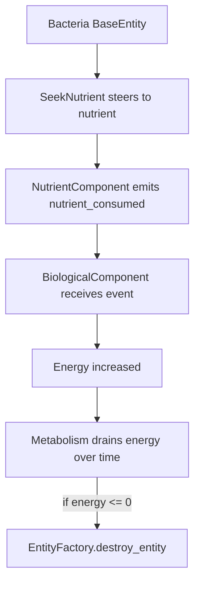

# Phase 2.2a — Bacteria Core Implementation (Godot 4.5, MVP+)

Purpose: Provide step-by-step, testable instructions for the code LLM agent to implement the first half of Phase 2.2 Bacteria, focusing on core scaffolding and minimal functional behaviors required for a playable ecosystem loop.

Scope split
- Included in 2.2a: Bacteria scene, BiologicalComponent with energy, health, age, metabolism drain, nutrient energy intake via events, SeekNutrient behavior using SpatialGrid, basic starvation death and cleanup, configuration and factory mapping, debug toggles.
- Deferred to 2.2b: Asexual reproduction and binary fission effects, organism state machine integration, animations and VFX polish, predator fear response, advanced balancing and tuning.

Existing foundation to integrate with
- Base entity and components: [BaseEntity.gd](scripts/components/BaseEntity.gd), [PhysicalComponent.gd](scripts/components/PhysicalComponent.gd), [IdentityComponent.gd](scripts/components/IdentityComponent.gd)
- Movement and simple behavior: [MovementComponent.gd](scripts/components/MovementComponent.gd), [RandomWander.gd](scripts/behaviors/RandomWander.gd)
- Nutrient systems: [Nutrient.tscn](scenes/entities/Nutrient.tscn), [NutrientComponent.gd](scripts/components/NutrientComponent.gd), [NutrientManager.gd](scripts/systems/NutrientManager.gd)
- Core systems: [EntityFactory.gd](scripts/systems/EntityFactory.gd), [EntityRegistry.gd](scripts/systems/EntityRegistry.gd), [GlobalEvents.gd](scripts/systems/GlobalEvents.gd), [SpatialGrid.gd](scripts/systems/SpatialGrid.gd), [PetriDish.gd](scripts/environments/PetriDish.gd), [EntityTypes.gd](scripts/components/EntityTypes.gd)
- Scene structure: [Main.tscn](scenes/Main.tscn), [Game.tscn](scenes/Game.tscn), [BaseEntity.tscn](scenes/entities/BaseEntity.tscn), [TestSpawner.gd](scripts/utils/TestSpawner.gd)

High-level outcomes for 2.2a
- Bacteria exist as a dedicated scene mapped in factory and pools
- Each bacterium has biological stats and metabolism ticking down energy
- Bacteria actively seek and consume nearby nutrients using spatial queries
- On consuming nutrient, energy increases; on starvation, entity dies and is cleaned up
- All behavior is parameterized via exported properties for tuning

Deliverables
1. Scene: scenes/entities/Bacteria.tscn
   - Inherits visual simplicity from BaseEntity style
   - Root Area2D with Collider CircleShape2D sized to default bacteria radius
   - entity_type set to BACTERIA
   - Components child containing:
     - MovementComponent with align_rotation on
     - SeekNutrient behavior component
     - BiologicalComponent
     - Optional RandomWander added as gentle fallback if no targets found

2. Component: scripts/components/BiologicalComponent.gd
   - Purpose: store and update biological stats and handle energy gain and death
   - Exports
     - energy_start: float default 6.0
     - energy_max: float default 12.0
     - metabolism_rate_per_sec: float default 0.8 energy per second
     - health_start: float default 1.0
     - max_age_sec: float default 180.0 set to 0 to disable
     - energy_from_nutrient_efficiency: float default 1.0 multiplier
     - debug_logging: bool
   - Runtime fields
     - energy, health, age_sec
   - Behavior
     - On init, cache BaseEntity, IdentityComponent, PhysicalComponent
     - Connect to GlobalEvents nutrient_consumed if not already connected
     - On update each frame
       - age_sec += delta
       - energy -= metabolism_rate_per_sec * delta
       - clamp energy to [0, energy_max]
       - if energy <= 0 or max_age exceeded then request destruction via EntityFactory
     - On nutrient_consumed event
       - if consumer_id matches this entity
         - look up nutrient node by id via EntityRegistry
         - read energy_value from its NutrientComponent if present
         - add energy_value * efficiency to energy and clamp to energy_max
         - emit optional signal energy_changed

3. Behavior: scripts/behaviors/SeekNutrient.gd
   - Purpose: steer towards the nearest nutrient within a sense radius using SpatialGrid, otherwise do nothing and allow RandomWander to bias movement
   - Exports
     - sense_radius: float default 160.0
     - target_refresh_interval: float default 0.25
     - acceleration_magnitude: float default 220.0
     - slow_radius: float default 24.0 start slowing near the target
     - use_spatial_grid: bool default true fallback to Area2D overlaps if needed
     - debug_draw_target: bool
   - Behavior
     - On init, cache MovementComponent, IdentityComponent, SpatialGrid
     - Every target_refresh_interval
       - query SpatialGrid.get_entities_in_radius using owner position and sense_radius
       - filter EntityRegistry nodes to EntityTypes NUTRIENT
       - choose closest by distance
     - On update
       - if target exists compute desired vector and set MovementComponent.acceleration to normalized vector * acceleration_magnitude
       - reduce acceleration inside slow_radius
       - if no target keep current acceleration untouched to allow RandomWander component to influence movement

4. Configuration and factory mapping
- In ConfigurationManager entity_scene_paths dictionary, add mapping for EntityTypes.EntityType.BACTERIA to res://scenes/entities/Bacteria.tscn
- Verify existing pool size for BACTERIA is sufficient
- Optionally call EntityFactory.register_entity_scene from a setup script if hot reloading mappings is needed

5. Test and debug harness
- Use existing Main scene which already wires PetriDish, SpatialGrid, NutrientManager
- Spawn bacteria using TestSpawner which already requests EntityTypes.BACTERIA
- Ensure Bacteria.tscn includes MovementComponent and SeekNutrient so TestSpawner does not add duplicates
- If TestSpawner still adds MovementComponent and RandomWander, ensure duplication is avoided by checking presence before adding
- Enable simple logging in BiologicalComponent to confirm energy and death events at low volume

Sequence diagram of nutrient consumption flow

Implementation steps for the agent
1. Create scripts/components/BiologicalComponent.gd with the specification above and minimal signals energy_changed died
2. Create scripts/behaviors/SeekNutrient.gd implementing the query and steering described
3. Create scenes/entities/Bacteria.tscn using BaseEntity as root and attach components listed under Deliverables item 1
4. Update scripts/systems/ConfigurationManager.gd to include the BACTERIA scene path mapping and verify pool sizes
5. Ensure scripts/systems/EntityFactory.gd will use the mapping automatically via ConfigurationManager; no code change required unless you add register calls
6. Verify integration
   - Run scenes/Main.tscn
   - Observe bacteria moving, steering to nutrients, consuming them and gaining energy
   - Let them starve by lowering nutrient_target_count in configuration and confirm they die and are removed from EntityRegistry
7. Guard against duplication of components when spawned via TestSpawner

Acceptance criteria
- Bacteria spawn using Bacteria.tscn via EntityFactory mapping and are tracked in EntityRegistry
- Energy decreases over time and increases when consuming a nutrient
- SeekNutrient reliably selects nearest nutrient within sense radius using SpatialGrid
- When energy reaches zero, the bacterium is destroyed via EntityFactory and removed from SpatialGrid
- No errors in Godot output during normal run; performance remains stable with 100 bacteria and 150 nutrients on screen
- All new behavior is adjustable via exported properties in the editor

File list to add or modify
- Add: [BiologicalComponent.gd](scripts/components/BiologicalComponent.gd)
- Add: [SeekNutrient.gd](scripts/behaviors/SeekNutrient.gd)
- Add: [Bacteria.tscn](scenes/entities/Bacteria.tscn)
- Modify: [ConfigurationManager.gd](scripts/systems/ConfigurationManager.gd)
- Optional modify: [TestSpawner.gd](scripts/utils/TestSpawner.gd)

Non goals and constraints
- Do not add reproduction logic, timers, or animations in 2.2a
- Avoid introducing a global state machine system yet; keep behaviors componentized
- Maintain BaseEntity drawing for bacteria to keep visuals simple for now

Notes and integration tips
- Subscribe to GlobalEvents signals on init and unsubscribe in cleanup to prevent leaks
- Use EntityRegistry to resolve entity ids to nodes and validate with is_instance_valid before access
- Keep per frame logic short; SeekNutrient should only do expensive queries at target_refresh_interval
- Use SpatialTrackerComponent already attached in EntityFactory to keep SpatialGrid up to date

Definition of done checklist
- All files compile and load in editor
- Manual test in Main scene shows bacteria seeking and consuming nutrients
- Entities cleanly despawn on starvation with no lingering grid registration
- Document the exported defaults in script headers for quick tuning by designers

Handover to Phase 2.2b
- With 2.2a complete, 2.2b will implement asexual reproduction trigger thresholds and cooldowns, binary fission animation and particle effects, and fold behaviors into the upcoming state machine framework from Phase 2.3