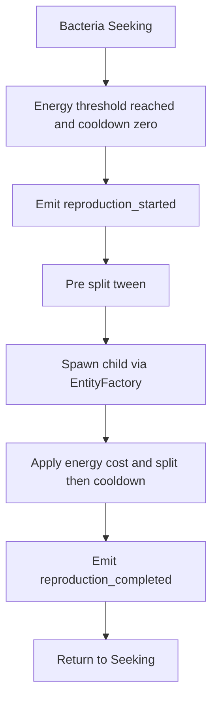
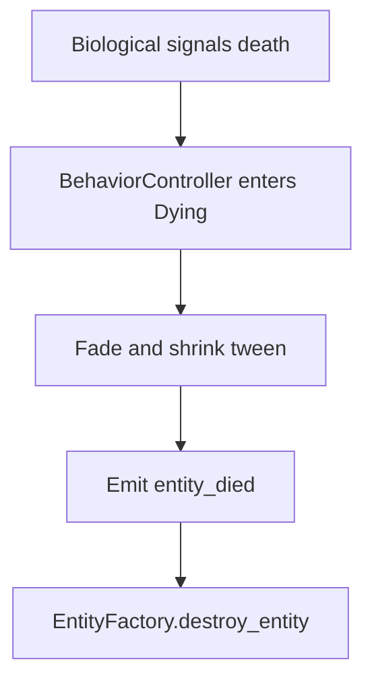

# Phase 2.2b — Bacteria Reproduction, State Integration, and Effects (v2)

Purpose: Implementation instructions to complete Phase 2.2 for Bacteria by adding asexual reproduction, temporary state coordination, polished death, and lightweight VFX, aligned to the current project code after Phase 2.2a.

Context completed in 2.2a
- Biological stats, metabolism, nutrient energy gain in [scripts/components/BiologicalComponent.gd]
- Nutrient seeking behavior in [scripts/behaviors/SeekNutrient.gd]
- Bacteria scene with core components in [scenes/entities/Bacteria.tscn]
- Scene mapping and pools in [scripts/systems/ConfigurationManager.gd] and factory wiring in [scripts/systems/EntityFactory.gd]
- Global events baseline in [scripts/systems/GlobalEvents.gd]

Out of scope in this phase
- Trait mutation and inheritance system beyond simple value copy
- Predator fear response and utility AI
- Full behavior framework from Phase 2.3, only a minimal temporary controller here

High level outcomes
- Bacteria divide by binary fission under configurable conditions, with cooldown and energy bookkeeping
- A minimal per entity behavior controller coordinates Seeking, Reproducing, and Dying without breaking existing movement components
- Reproduction and death have visible feedback using tweens and a small CPUParticles2D node
- Events are emitted for reproduction and death for future UI and analytics

Design principles for v2
- Additive Changes Only: Do not break existing systems, keep coupling low via signals and GlobalEvents
- Editor Tunable: All thresholds and timings exported where useful
- Replaceable Later: The temporary controller mirrors naming from [AGENTS/system_architecture.md]

Deliverables
1. Reproduction configuration in [scripts/systems/ConfigurationManager.gd]
   - Exported variables with defaults
     - bacteria_repro_energy_threshold default 10.0
     - bacteria_repro_cooldown_sec default 8.0
     - bacteria_repro_energy_cost_ratio default 0.2
     - bacteria_offspring_energy_split_ratio default 0.5
     - bacteria_offspring_offset_radius default 10.0
     - bacteria_max_children_per_min default 20
   - These appear in the inspector and are read by behavior code at runtime

2. Identity and genealogy in [scripts/components/IdentityComponent.gd]
   - Add fields
     - generation int default 0
     - parent_id StringName default empty
   - On initialization, keep existing uuid generation, do not reset generation or parent_id when pooled

3. Biological extensions in [scripts/components/BiologicalComponent.gd]
   - Runtime fields
     - repro_cooldown_timer float, starts at 0
     - pending_repro bool, default false
   - Update
     - decrement repro_cooldown_timer by delta, clamp to 0
   - Provide helper semantics
     - should_reproduce evaluates energy and cooldown against ConfigurationManager thresholds and returns a boolean
     - apply_reproduction_bookkeeping performs energy cost, computes parent_child energies, and sets cooldown on parent
   - Death flow
     - Emit signal died with reason as already implemented
     - Do not directly queue destruction if a BehaviorController is present, see State integration below

4. Global events in [scripts/systems/GlobalEvents.gd]
   - Add signals
     - bacteria_reproduction_started entity_id
     - bacteria_reproduction_completed parent_id child_id
     - entity_died entity_id entity_type cause
   - Continue to emit existing entity_destroyed from [scripts/systems/EntityFactory.gd]

5. Temporary behavior controller and states
   - Add files
     - scripts/behaviors/state/State.gd abstract, defines enter update exit as no op methods
     - scripts/behaviors/state/StateMachine.gd holds current state and transition logic
     - scripts/behaviors/BehaviorController.gd entity component that owns the StateMachine and coordinates with existing components
     - scripts/behaviors/bacteria/BacteriaStateSeeking.gd default state, coexists with [scripts/behaviors/SeekNutrient.gd]
     - scripts/behaviors/bacteria/BacteriaStateReproducing.gd drives fission tween and spawn
     - scripts/behaviors/bacteria/BacteriaStateDying.gd plays fade shrink then destroys via [scripts/systems/EntityFactory.gd]
   - Controller responsibilities
     - On ready, cache BaseEntity, MovementComponent, BiologicalComponent, IdentityComponent, PhysicalComponent
     - Connect to BiologicalComponent.died to transition to Dying and intercept immediate destruction
     - In update, if BiologicalComponent.should_reproduce and not currently Reproducing or Dying, transition to Reproducing
     - Maintain a simple per entity circular buffer or time window to enforce bacteria_max_children_per_min
   - State behavior
     - Seeking leaves existing components active and only observes conditions
     - Reproducing sets MovementComponent.acceleration to zero, runs pre split tween, then spawns child, applies energy split, emits GlobalEvents, returns to Seeking
     - Dying zeros movement, plays fade shrink tween, emits GlobalEvents.entity_died, then calls EntityFactory.destroy_entity

6. Binary fission VFX and SFX
   - In [scenes/entities/Bacteria.tscn]
     - Add a CPUParticles2D child named FissionBurst initially Emitting false
     - Configure a small burst with color gradient near base_color, short lifetime
   - Pre split tween
     - Scale PhysicalComponent.size up by 15 percent over 0.2 s
     - Pulse BaseEntity.base_color slightly brighter over the same duration
   - Split moment
     - Spawn offspring, briefly emit FissionBurst
   - Post split tween
     - Tween size and color back to baseline over 0.2 s on both parent and child

7. Death animation polish
   - When BiologicalComponent signals died, BehaviorController transitions to Dying
   - Play 0.3 s tween that shrinks PhysicalComponent.size and fades BaseEntity.base_color alpha toward 0
   - Optionally reuse FissionBurst with a softer count as a puff
   - After tween completes, call EntityFactory.destroy_entity with cause

8. Inheritance policy for 2.2b
   - On child spawn copy values from parent
     - size from BaseEntity.size
     - movement speed from MovementComponent.max_speed
     - base_color with a tiny jitter optional
   - Identity
     - child.identity.generation set to parent.identity.generation plus 1
     - child.identity.parent_id set to parent.identity.uuid

Reproduction flow

Death flow

Implementation steps
1. Add reproduction exports to [scripts/systems/ConfigurationManager.gd] grouped under a Bacteria reproduction header
2. Extend [scripts/components/IdentityComponent.gd] with generation and parent_id fields and preserve across pooling
3. Update [scripts/components/BiologicalComponent.gd] to track cooldown, provide should_reproduce and energy bookkeeping, and continue emitting died
4. Add new signals to [scripts/systems/GlobalEvents.gd] and keep existing entity_destroyed usage
5. Create state scaffolding files under scripts/behaviors and implement minimal transitions described above
6. Update [scenes/entities/Bacteria.tscn] to add BehaviorController under Components and a CPUParticles2D for FissionBurst
7. Implement BacteriaStateReproducing to run tweens, spawn offspring using [scripts/systems/EntityFactory.gd] create_entity_clamped, set child params and identity links, apply cooldown, emit events
8. Implement BacteriaStateDying to tween, emit events, and call destruction
9. Validate with the testing plan and tune exports in editor

Testing plan
- Fast reproduction
  - In [scripts/systems/ConfigurationManager.gd] lower bacteria_repro_energy_threshold to 6.0 and increase nutrient_target_count
  - Observe multiple reproduction events, verify children remain within dish bounds
- Cooldown and limiter
  - Raise bacteria_repro_cooldown_sec and verify reproduction cannot occur before timer elapses
  - Push population to ensure bacteria_max_children_per_min prevents runaway growth
- Death polish
  - Reduce nutrient_target_count and confirm death tweens run and no ghosts remain in [scripts/systems/SpatialGrid.gd]
- Event emissions
  - Log or connect to signals in [scripts/systems/GlobalEvents.gd] to see bacteria_reproduction_started, bacteria_reproduction_completed, entity_died firing
- Stability
  - Run with 200 bacteria and 200 nutrients and confirm steady frame rate and no errors in console

Acceptance criteria
- Bacteria reproduce by binary fission under configured conditions, with visible VFX
- Child entities spawn via [scripts/systems/EntityFactory.gd] inside dish bounds and register in [scripts/systems/EntityRegistry.gd]
- Energy cost, split, and cooldown are correct and tunable through [scripts/systems/ConfigurationManager.gd]
- Temporary behavior controller coordinates Seeking, Reproducing, Dying without runtime errors and is structured to be replaceable per [AGENTS/system_architecture.md]
- Death animation plays then reliably removes entities from [scripts/systems/SpatialGrid.gd] and [scripts/systems/EntityRegistry.gd]
- Performance remains stable at target counts

File list to add or modify
- Add: scripts/behaviors/state/State.gd
- Add: scripts/behaviors/state/StateMachine.gd
- Add: scripts/behaviors/BehaviorController.gd
- Add: scripts/behaviors/bacteria/BacteriaStateSeeking.gd
- Add: scripts/behaviors/bacteria/BacteriaStateReproducing.gd
- Add: scripts/behaviors/bacteria/BacteriaStateDying.gd
- Modify: [scripts/systems/ConfigurationManager.gd]
- Modify: [scripts/components/BiologicalComponent.gd]
- Modify: [scripts/components/IdentityComponent.gd]
- Modify: [scripts/systems/GlobalEvents.gd]
- Modify: [scenes/entities/Bacteria.tscn]

Implementation notes
- Keep new scripts short and focused, under 300 lines
- Prefer signals and GlobalEvents for decoupling, avoid tight references across systems
- BehaviorController should degrade gracefully if any referenced component is missing
- For tweens use SceneTreeTween for simplicity and ensure to handle pooled instances by resetting size and color at enter

Editor tuning references
- SeekNutrient exports in [scripts/behaviors/SeekNutrient.gd] can be adjusted for sense and steering balance
- Movement tuning in [scripts/components/MovementComponent.gd] for speed and damping
- Biological metabolism in [scripts/components/BiologicalComponent.gd]

Migration to Phase 2.3
- Name the controller BehaviorController and keep states stateless where possible to migrate into the formal Behavior Control System described in [AGENTS/system_architecture.md]
- Encapsulate state transitions so later replacement with a fuller StateManager is straightforward

Risks and mitigations
- Double destruction risk if both BiologicalComponent and Dying state call destroy_entity, mitigate by letting BehaviorController intercept died and own the final destruction
- Pooling reset issues, mitigate by resetting tweaked visuals in state enter
- Population explosion, mitigate using bacteria_max_children_per_min and reproduction cost

End of document