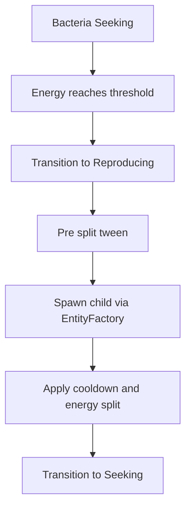

# Phase 2.2b — Bacteria Reproduction, State Integration, and Effects (Godot 4.5, MVP+)

Purpose: Provide implementation instructions for completing Phase 2.2 Bacteria by adding asexual reproduction, lightweight state integration, animations and effects, and polish. This builds on Phase 2.2a.

Scope in 2.2b
- Included: Asexual reproduction trigger and cooldown, binary fission animation and effects, temporary organism state machine integration aligned with Phase 2.3 design, bacteria death animation polish, debug visualization hooks, configuration parameters and events.
- Out of scope: Trait mutation and inheritance system, predator fear response mechanics, complex utility AI, full global state machine framework.

Prerequisites
- Completed 2.2a deliverables: [AGENTS/phase_2.2a.md](AGENTS/phase_2.2a.md)
- Existing systems: [EntityFactory.gd](scripts/systems/EntityFactory.gd), [EntityRegistry.gd](scripts/systems/EntityRegistry.gd), [GlobalEvents.gd](scripts/systems/GlobalEvents.gd), [SpatialGrid.gd](scripts/systems/SpatialGrid.gd), [PetriDish.gd](scripts/environments/PetriDish.gd), [ConfigurationManager.gd](scripts/systems/ConfigurationManager.gd), [BiologicalComponent.gd](scripts/components/BiologicalComponent.gd), [SeekNutrient.gd](scripts/behaviors/SeekNutrient.gd), [Bacteria.tscn](scenes/entities/Bacteria.tscn)

High level outcomes
- Bacteria reproduce by binary fission when energy and conditions are met, with cooldown and energy cost.
- Lightweight per organism state machine controls Seeking, Feeding, Reproducing, Dying states and can be swapped for the Phase 2.3 system later.
- Visual feedback for reproduction and death via tweens and simple particle effects.
- Events emitted for reproduction start and completion, aiding debug and future UI.

Deliverables
1. Reproduction logic
   - Add reproduction parameters to [ConfigurationManager.gd](scripts/systems/ConfigurationManager.gd):
     - bacteria_repro_energy_threshold default 10.0
     - bacteria_repro_cooldown_sec default 8.0
     - bacteria_repro_energy_cost_ratio default 0.2 portion of current energy spent on division overhead
     - bacteria_offspring_energy_split_ratio default 0.5 split remaining energy between parent and child
     - bacteria_offspring_offset_radius default 10.0 spawn offset
     - bacteria_max_children_per_min default 20 safety limiter to avoid runaway
   - Extend [BiologicalComponent.gd](scripts/components/BiologicalComponent.gd) with fields:
     - repro_cooldown_timer
     - pending_repro boolean
   - Condition to reproduce:
     - energy greater or equal threshold
     - repro_cooldown_timer less or equal 0
     - current state is not Reproducing or Dying
   - Division sequence:
     - Enter Reproducing state
     - Play pre split animation described below
     - Compute energy cost and new energy values
     - Spawn offspring through [EntityFactory.gd](scripts/systems/EntityFactory.gd) using create_entity_clamped with a small offset
     - Initialize offspring with inherited parameters see Inheritance below
     - Apply cooldown and finish state

2. Temporary state machine integration
   - Add local minimal state machine under scripts/behaviors/state:
     - [State.gd](scripts/behaviors/state/State.gd) abstract with enter update exit method stubs
     - [StateMachine.gd](scripts/behaviors/state/StateMachine.gd) holds current state and handles transition
   - Add bacteria specific states under scripts/behaviors/bacteria:
     - [BacteriaStateSeeking.gd](scripts/behaviors/bacteria/BacteriaStateSeeking.gd) uses SeekNutrient as steering and transitions to Feeding when overlapping nutrient or to Reproducing when energy threshold reached
     - [BacteriaStateFeeding.gd](scripts/behaviors/bacteria/BacteriaStateFeeding.gd) waits for a short dwell or nutrient_consumed event then goes back to Seeking
     - [BacteriaStateReproducing.gd](scripts/behaviors/bacteria/BacteriaStateReproducing.gd) runs the tween then spawns offspring and returns to Seeking
     - [BacteriaStateDying.gd](scripts/behaviors/bacteria/BacteriaStateDying.gd) plays death animation then requests destruction
   - Add a thin [BehaviorController.gd](scripts/behaviors/BehaviorController.gd) component attached to Bacteria.tscn that owns the StateMachine instance and exposes current_state for debug
   - Design states and controller API to match Phase 2.3 plan in [AGENTS/system_architecture.md](AGENTS/system_architecture.md) and [AGENTS/phased_plan.md](AGENTS/phased_plan.md) so migration is trivial

3. Binary fission animation and effects
   - Pre split tween
     - Scale visual radius up by 10 to 20 percent using PhysicalComponent size tween over 0.2 s
     - Slight color pulse brighten base_color using modulate tween
   - Split moment
     - Spawn offspring
     - Trigger small particle burst if available using a CPUParticles2D child on the Bacteria scene for portability
   - Post split tween
     - Parent and child size tween back to normal over 0.2 s

4. Death animation polish
   - On death cause starvation or external add a simple fade and shrink tween 0.3 s and optional particle puff
   - Ensure SpatialTrackerComponent removes entity from grid before pooling entity to avoid ghost references

5. Identity and basic inheritance
   - Extend [IdentityComponent.gd](scripts/components/IdentityComponent.gd) to add:
     - generation int default 0
     - parent_id StringName default empty
   - In reproduction set child.generation to parent.generation plus 1 and child.parent_id to parent.uuid
   - Inheritance of traits in 2.2b keep it simple
     - size inherit same as parent
     - speed from MovementComponent max_speed inherit same value
     - color base_color small jitter optional

6. Events and statistics
   - Add new signals to [GlobalEvents.gd](scripts/systems/GlobalEvents.gd):
     - bacteria_reproduction_started entity_id
     - bacteria_reproduction_completed parent_id child_id
     - entity_died entity_id entity_type cause
   - Emit these signals in the reproduction and death paths for future UI and analytics

7. Scene and wiring updates
   - Update [Bacteria.tscn](scenes/entities/Bacteria.tscn) to include:
     - Components child includes MovementComponent SeekNutrient BiologicalComponent BehaviorController and a CPUParticles2D for fission effect initially inactive
     - Ensure collider radius is linked to PhysicalComponent size as already handled by [PhysicalComponent.gd](scripts/components/PhysicalComponent.gd)

Reproduction flow

Detailed implementation steps
1. Update [ConfigurationManager.gd](scripts/systems/ConfigurationManager.gd) with reproduction properties and sensible defaults
2. Extend [IdentityComponent.gd](scripts/components/IdentityComponent.gd) with generation and parent_id fields and ensure initialization in init
3. Enhance [BiologicalComponent.gd](scripts/components/BiologicalComponent.gd)
   - Track and decrement repro_cooldown_timer
   - Expose should_reproduce check
   - Provide perform_reproduction helper that orchestrates energy bookkeeping and calls a callback to actually spawn child
4. Add state machine scaffolding files under scripts/behaviors/state and scripts/behaviors/bacteria as listed above and attach [BehaviorController.gd](scripts/behaviors/BehaviorController.gd) to Bacteria scene
5. Implement binary fission animation with Tweens controlled by BacteriaStateReproducing and wire GlobalEvents emissions
6. Implement death animation in BacteriaStateDying and guarantee cleanup ordering
7. Update [Bacteria.tscn](scenes/entities/Bacteria.tscn) to include the new components and CPUParticles2D
8. Run through testing plan below and validate acceptance criteria

Testing plan
- Reproduction
  - Lower bacteria_repro_energy_threshold to a small value like 6.0 and increase nutrient density to accelerate testing via [ConfigurationManager.gd](scripts/systems/ConfigurationManager.gd)
  - Observe multiple reproduction events and verify signals fired
- Cooldown and caps
  - Set bacteria_repro_cooldown_sec high and confirm limited reproduction rate
  - Confirm safety limiter avoids exponential explosion
- Death polish
  - Reduce nutrient_target_count and confirm death animation then cleanup with no errors
- State transitions
  - Enable debug logging and ensure transitions occur as expected Seeking to Feeding to Reproducing and to Dying

Acceptance criteria
- Bacteria reproduce via binary fission under configured conditions with visible VFX and SFX if available
- New child entities spawn within dish bounds using [EntityFactory.gd](scripts/systems/EntityFactory.gd) and are registered in [EntityRegistry.gd](scripts/systems/EntityRegistry.gd)
- Energy and cooldown bookkeeping is correct and configurable
- Temporary state machine controls behavior without runtime errors and is structured to be replaceable by Phase 2.3
- Death uses polished animation and frees entities reliably from [SpatialGrid.gd](scripts/systems/SpatialGrid.gd) and [EntityRegistry.gd](scripts/systems/EntityRegistry.gd)
- Performance remains stable with 200 bacteria and 200 nutrients on screen

File list to add or modify
- Add: [State.gd](scripts/behaviors/state/State.gd)
- Add: [StateMachine.gd](scripts/behaviors/state/StateMachine.gd)
- Add: [BehaviorController.gd](scripts/behaviors/BehaviorController.gd)
- Add: [BacteriaStateSeeking.gd](scripts/behaviors/bacteria/BacteriaStateSeeking.gd)
- Add: [BacteriaStateFeeding.gd](scripts/behaviors/bacteria/BacteriaStateFeeding.gd)
- Add: [BacteriaStateReproducing.gd](scripts/behaviors/bacteria/BacteriaStateReproducing.gd)
- Add: [BacteriaStateDying.gd](scripts/behaviors/bacteria/BacteriaStateDying.gd)
- Modify: [ConfigurationManager.gd](scripts/systems/ConfigurationManager.gd)
- Modify: [BiologicalComponent.gd](scripts/components/BiologicalComponent.gd)
- Modify: [IdentityComponent.gd](scripts/components/IdentityComponent.gd)
- Modify: [GlobalEvents.gd](scripts/systems/GlobalEvents.gd)
- Modify: [Bacteria.tscn](scenes/entities/Bacteria.tscn)

Notes
- Keep all new scripts under 300 lines and focused on single responsibility
- Use signals and GlobalEvents to keep coupling low and prepare for UI overlays in later phases
- Avoid introducing hard dependencies on future systems beyond directory placement and class names
- Favor exported properties for all tunables to support designer iteration