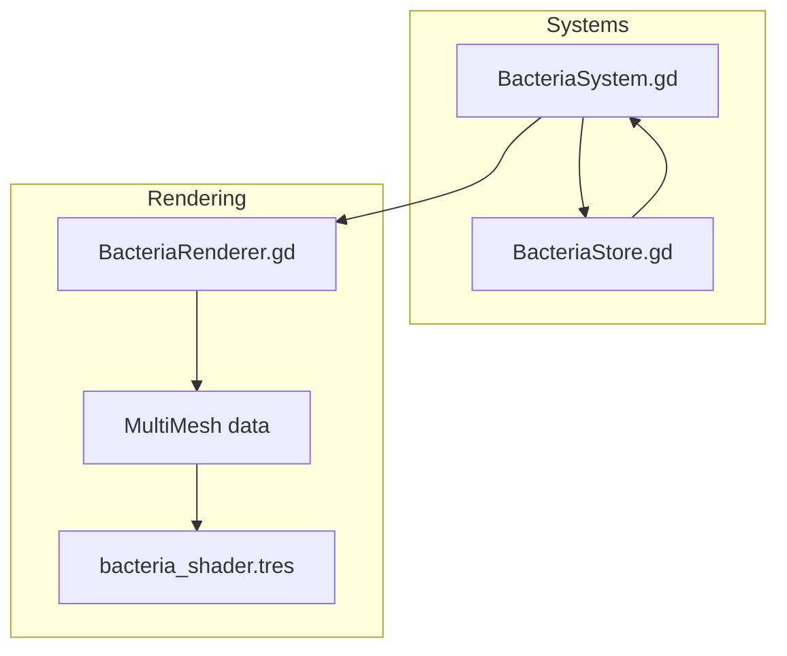

# Phase A issues resolution plan — Godot 4.5 MultiMesh color/custom

Purpose
- Provide a concrete, Godot 4.5-safe plan to restore per-instance rendering with MultiMesh for bacteria, replacing the prior node-pooling approach.
- Resolve parser/runtime conflicts around per-instance color and custom channels by standardizing on a RenderingServer-backed allocation and adding a runtime capability probe with graceful fallback.
- Keep external APIs and system wiring stable per the MVP Phase A scope in [AGENTS/phase_a.md](AGENTS/phase_a.md).

Context and current state
- Prior object pooling created hundreds/thousands of scene nodes and caused startup stalls. Phase A moves bacteria rendering to a single GPU-instanced path.
- The bacteria renderer is implemented at [BacteriaRenderer.gd](scripts/rendering/BacteriaRenderer.gd) and is instantiated via [BacteriaRenderer.tscn](scenes/renderers/BacteriaRenderer.tscn). Per-frame updates flow from [BacteriaSystem.gd](scripts/systems/BacteriaSystem.gd).
- Shader uses instance color and transform scale; see [scripts/shaders/bacteria_shader.tres](scripts/shaders/bacteria_shader.tres).
- Reported engine/parser errors when configuring per-instance formats directly on MultiMesh properties (flat vs nested enum symbols) per [AGENTS/issues.md](AGENTS/issues.md).
- A RenderingServer-backed allocation has been introduced at [BacteriaRenderer.init()](scripts/rendering/BacteriaRenderer.gd:20), calling [RenderingServer.multimesh_allocate_data()](scripts/rendering/BacteriaRenderer.gd:27).

Problem statement (from reproduced errors)
- Parser Error: Cannot find member 'ColorFormat' in base 'MultiMesh'.
- Invalid assignment of property or key 'color_format' with value of type 'int' on a base object of type 'MultiMesh'.
- Impact: Per-instance COLOR defaults to white; INSTANCE_CUSTOM defaults to zero. Blocks per-instance color/custom for Phase A.

Constraints and goals
- Engine version: Godot 4.5 (symbols around MultiMesh enums may differ by build). Keep changes robust against parser symbol differences.
- Phase A goals (per [AGENTS/phase_a.md](AGENTS/phase_a.md)):
  - Use a single GPU-instanced renderer for bacteria, stable frame times.
  - Provide per-instance size (via transform scale) and color.
  - Keep spawn/despawn APIs stable through [EntityFactory.gd](scripts/systems/EntityFactory.gd) and [BacteriaSystem.gd](scripts/systems/BacteriaSystem.gd).
  - Maintain rollback to node-based path via [ConfigurationManager.gd](scripts/systems/ConfigurationManager.gd).

Decision summary
1) Standardize on RenderingServer allocation for MultiMesh instance data
   - Done in [BacteriaRenderer.init()](scripts/rendering/BacteriaRenderer.gd:20) via [RenderingServer.multimesh_allocate_data()](scripts/rendering/BacteriaRenderer.gd:27) to select:
     - Transform format: 2D
     - Color format: 8-bit
     - Custom data format: 8-bit
   - Avoids direct enum property assignment on MultiMesh and removes parser symbol ambiguity.

2) Add a runtime capability probe and guarded writes
   - At first activation, probe support for per-instance color and custom data and record booleans.
   - Only call [BacteriaRenderer.set_slot()](scripts/rendering/BacteriaRenderer.gd:56) paths that write color/custom when supported, else degrade to uniform color.
   - Keep per-instance transform scale for size regardless.

3) Maintain graceful fallback
   - If per-instance color/custom is unsupported at runtime, use material modulate as a uniform color fallback; ensure transform-based sizing still works.
   - Preserve existing APIs so callers do not change.

Capability matrix (Phase A)
- Required
  - Transform2D per-instance for size and placement: provided by [BacteriaRenderer.set_slot()](scripts/rendering/BacteriaRenderer.gd:56) via [MultiMesh.set_instance_transform_2d()](scripts/rendering/BacteriaRenderer.gd:68).
- Preferred (enable when supported)
  - COLOR per-instance: [MultiMesh.set_instance_color()](scripts/rendering/BacteriaRenderer.gd:69).
  - INSTANCE_CUSTOM per-instance: [MultiMesh.set_instance_custom_data()](scripts/rendering/BacteriaRenderer.gd:70) reserved for future features.
- Fallback (if preferred channels unsupported)
  - Uniform color via material modulate; keep per-instance transform scaling.

Detailed implementation plan

A) RenderingServer-based MultiMesh allocation
- Where: [BacteriaRenderer.init()](scripts/rendering/BacteriaRenderer.gd:20).
- Action:
  - Continue using [RenderingServer.multimesh_allocate_data()](scripts/rendering/BacteriaRenderer.gd:27) with:
    - MULTIMESH_TRANSFORM_2D
    - MULTIMESH_COLOR_8BIT
    - MULTIMESH_CUSTOM_DATA_8BIT
  - Keep [transform_format](scripts/rendering/BacteriaRenderer.gd:24) = TRANSFORM_2D for editor clarity; RS allocation is the authoritative setup.
- Mesh and material:
  - Ensure a unit [QuadMesh](scripts/rendering/BacteriaRenderer.gd:37) sized 1x1 so shader can SDF a circle with transform scaling.
  - Ensure a [ShaderMaterial](scripts/rendering/BacteriaRenderer.gd:43) using [bacteria_shader.tres](scripts/shaders/bacteria_shader.tres).

B) Per-instance write path (no API changes)
- Where: [BacteriaRenderer.set_slot()](scripts/rendering/BacteriaRenderer.gd:56).
- Current behavior:
  - Build Transform2D with local scale by diameter; write via [set_instance_transform_2d](scripts/rendering/BacteriaRenderer.gd:68).
  - Write [set_instance_color](scripts/rendering/BacteriaRenderer.gd:69) and [set_instance_custom_data](scripts/rendering/BacteriaRenderer.gd:70).
- Guarded writes (to add with capability probe):
  - Only perform color/custom writes if capability flags are true; otherwise skip and rely on material modulate.

C) Capability probe and logging
- Where: augment [BacteriaRenderer._ready()](scripts/rendering/BacteriaRenderer.gd:14) or first call to init.
- Probe steps:
  - Inspect _mm.get_property_list() and log presence of color_format/custom_data_format.
  - Attempt a safe, temporary write on instance 0 (or a dedicated scratch index) with [set_instance_color](scripts/rendering/BacteriaRenderer.gd:69) and [set_instance_custom_data](scripts/rendering/BacteriaRenderer.gd:70); catch errors.
  - Record flags: _supports_instance_color, _supports_instance_custom. If false, log a clear one-time warning.
- Runtime behavior:
  - If per-instance color unsupported: set material modulate to default bacteria color on the node’s material and skip per-instance color writes.
  - If custom unsupported: skip custom writes; keep transform scaling.

D) Shader interface contract
- Shader: [scripts/shaders/bacteria_shader.tres](scripts/shaders/bacteria_shader.tres).
- Contract:
  - COLOR comes from instance color when available; alpha is multiplied by an antialiased edge in [fragment](scripts/shaders/bacteria_shader.tres:16).
  - Instance transform scale defines size (radius x 2 mapped to local scale); see Transform2D writes in [BacteriaRenderer.set_slot()](scripts/rendering/BacteriaRenderer.gd:62).
  - INSTANCE_CUSTOM reserved for future variants; for Phase A, no branching on custom required to ship.
- Fallback:
  - If per-instance color disabled, ensure material modulate is applied uniformly; the shader continues to render circles with AA edge smoothing.

E) System integration and API stability
- Bacteria system uses the renderer via stable calls:
  - Renderer init: [BacteriaSystem._ready()](scripts/systems/BacteriaSystem.gd:24) → [BacteriaRenderer.init()](scripts/rendering/BacteriaRenderer.gd:20).
  - Spawn path: [BacteriaSystem.spawn_bacteria()](scripts/systems/BacteriaSystem.gd:58) calls [set_slot](scripts/rendering/BacteriaRenderer.gd:56) for the allocated index.
  - Per-frame update: [BacteriaSystem._process()](scripts/systems/BacteriaSystem.gd:91) writes transform/color/custom via [set_slot](scripts/rendering/BacteriaRenderer.gd:56), then [commit](scripts/rendering/BacteriaRenderer.gd:77).
- Entity factory routes bacteria to the system when MultiMesh is enabled:
  - See [EntityFactory._ready()](scripts/systems/EntityFactory.gd:17) guardrails and [EntityFactory.create_entity()](scripts/systems/EntityFactory.gd:71).
  - Destroy flow delegates appropriately at [EntityFactory.destroy_entity()](scripts/systems/EntityFactory.gd:113).
- Rollback remains available via [ConfigurationManager.is_bacteria_multimesh_enabled()](scripts/systems/ConfigurationManager.gd:153), controlled by [ConfigurationManager.bacteria_render_mode](scripts/systems/ConfigurationManager.gd:27).

F) Fallback details (when per-instance color/custom unsupported)
- Uniform color:
  - Set a single modulate color on the assigned [ShaderMaterial](scripts/rendering/BacteriaRenderer.gd:43) or via node material modulate.
  - Continue to update transform scale for size; visuals remain correct for Phase A’s circle rendering.
- Hidden/empty slots:
  - Maintain collapsing transforms and zeroed channels in [_hide_index](scripts/rendering/BacteriaRenderer.gd:81) using [set_instance_transform_2d](scripts/rendering/BacteriaRenderer.gd:88), [set_instance_color](scripts/rendering/BacteriaRenderer.gd:89), and [set_instance_custom_data](scripts/rendering/BacteriaRenderer.gd:90).

Validation and test checklist
- Startup diagnostics:
  - Log detected support for instance color/custom and whether guarded writes are enabled.
  - Confirm no parser/runtime errors on scene load: open [scenes/Main.tscn](scenes/Main.tscn) and run.
- Visual validation:
  - Spawn thousands of bacteria; verify smooth frame time in first 5 seconds, circles rendered with AA edges per shader and scale reflects radius.
  - If per-instance color is supported, verify varied per-instance colors are visible; if not, verify uniform modulate color applies to all.
- System integrity:
  - Spatial grid updates remain correct; see updates at [BacteriaSystem._process()](scripts/systems/BacteriaSystem.gd:152).
  - Metrics logging appears at 1 Hz from [BacteriaSystem._process()](scripts/systems/BacteriaSystem.gd:160).
- Regression guard:
  - Toggle [ConfigurationManager.bacteria_render_mode](scripts/systems/ConfigurationManager.gd:27) to 0 and confirm node-based path still functions.

Risks and mitigations
- Risk: Engine variant differences around format configuration persist.
  - Mitigation: RS allocation is the authoritative path; avoid direct MultiMesh enum property assignments.
- Risk: Editor parser vs runtime mismatch.
  - Mitigation: Perform runtime probe; guard writes accordingly; log once and continue with fallbacks.
- Risk: Web export or specific platforms handle instance color/custom differently.
  - Mitigation: Keep capability probe in all builds; document flags in logs; default to uniform color if unsupported.

Open questions to collect from environment
- Exact Godot version string and export target(s).
- Whether errors reproduced in editor, exported build, or both.
- Any custom language server/editor settings impacting parser behavior.

Mermaid: render data flow overview (Phase A)

Appendix A — references for code agents
- RS allocation site and constants: [BacteriaRenderer.init()](scripts/rendering/BacteriaRenderer.gd:20), [RenderingServer.multimesh_allocate_data()](scripts/rendering/BacteriaRenderer.gd:27).
- Per-instance writes: [set_instance_transform_2d](scripts/rendering/BacteriaRenderer.gd:68), [set_instance_color](scripts/rendering/BacteriaRenderer.gd:69), [set_instance_custom_data](scripts/rendering/BacteriaRenderer.gd:70).
- Hide/clear path: [_hide_index](scripts/rendering/BacteriaRenderer.gd:81).
- Shader contract using COLOR: see fragment lines in [bacteria_shader.tres](scripts/shaders/bacteria_shader.tres:16).
- System wiring and usage: [BacteriaSystem._ready()](scripts/systems/BacteriaSystem.gd:24), [BacteriaSystem.spawn_bacteria()](scripts/systems/BacteriaSystem.gd:58), [BacteriaSystem._process()](scripts/systems/BacteriaSystem.gd:91).
- Factory routing and guardrails: [EntityFactory._ready()](scripts/systems/EntityFactory.gd:17), [EntityFactory.create_entity()](scripts/systems/EntityFactory.gd:71), [EntityFactory.destroy_entity()](scripts/systems/EntityFactory.gd:113).
- Configuration toggle/rollback: [ConfigurationManager.bacteria_render_mode](scripts/systems/ConfigurationManager.gd:27), [ConfigurationManager.is_bacteria_multimesh_enabled()](scripts/systems/ConfigurationManager.gd:153).

Appendix B — step-by-step tasks for the code agent
1) Add capability probe and flags
   - Add _supports_instance_color and _supports_instance_custom to [BacteriaRenderer.gd](scripts/rendering/BacteriaRenderer.gd).
   - Implement probe on first init: property list check + tiny write try/catch; log once.
2) Guard per-instance writes
   - In [BacteriaRenderer.set_slot()](scripts/rendering/BacteriaRenderer.gd:56), conditionally call [set_instance_color](scripts/rendering/BacteriaRenderer.gd:69) and [set_instance_custom_data](scripts/rendering/BacteriaRenderer.gd:70) based on flags.
3) Implement fallback color path
   - If per-instance color unsupported, set node material modulate to default color in [BacteriaRenderer.init()](scripts/rendering/BacteriaRenderer.gd:20) and skip instance color writes.
4) Enhance startup logs
   - Log capability results in renderer ready/init and one-line summary in [BacteriaSystem._ready()](scripts/systems/BacteriaSystem.gd:24) when initializing the renderer.
5) Validate end-to-end
   - Run [scenes/Main.tscn](scenes/Main.tscn) with bacteria_initial_count ≥ 2000; observe performance and visuals; inspect logs.
6) Document results
   - Update [AGENTS/issues.md](AGENTS/issues.md) Current status section with capability detection outcome and any engine-specific notes.

Rollback plan
- Immediate: Set [ConfigurationManager.bacteria_render_mode](scripts/systems/ConfigurationManager.gd:27) = 0 to restore node-based path. No code changes required.

This document is the authoritative plan for resolving per-instance color/custom issues on Godot 4.5 for Phase A. It keeps APIs stable, provides a robust path via RS allocation, and specifies a capability probe with graceful fallbacks to ensure consistent behavior across editor and export targets.