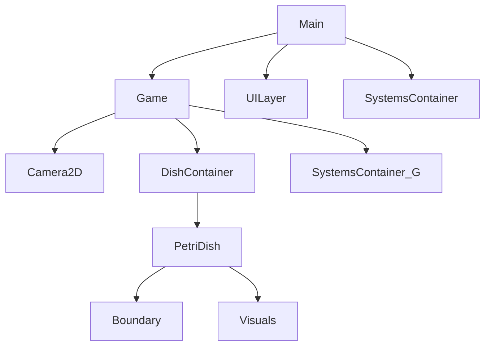

# Phase 1.1 — Project Setup and Configuration (Coder AI Instruction Pack)

Purpose: establish consistent Godot 4.5 settings, folder and scene scaffold, autoload singletons, and input map so subsequent systems can be implemented without rework.

Deliverables
- Updated project.godot with settings below
- Extended .gitignore baseline
- Created folders and empty placeholder scenes
- Autoload singletons added and stubbed
- Input Map actions defined
- Project runs to a blank main scene with camera and UI layers present

Acceptance Criteria
- Project boots with no errors or warnings in Output
- Main scene loads by default and window scales correctly when resized
- Camera2D exists in the scene and responds to mouse wheel zoom in Editor test (no gameplay logic yet)
- Autoloads are registered and print a ready message once on launch
- Input Map shows all listed actions with bindings
- Scene tree matches the scaffold specified below
- .gitignore ignores .godot and .import at minimum

Implementation Plan Overview
1. Apply project settings for rendering, window, physics, and main scene
2. Extend .gitignore
3. Create folder scaffold
4. Create base scenes and wire them together
5. Create autoload singleton stubs and register them
6. Define Input Map actions and default bindings
7. Verify run in editor and commit

Project Settings Blueprint
Perform via Editor menu Project Settings, then Save. Where exact keys are helpful, they are listed for reference.

Application
- application/run/main_scene = res://scenes/Main.tscn
- application/config/name = Petri

Rendering
- rendering/renderer/rendering_method = forward_plus  Note: current file uses mobile, switch to forward_plus for desktop primary target

Window and Stretch
- display/window/size/viewport_width = 1920
- display/window/size/viewport_height = 1080
- display/window/stretch/mode = canvas_items
- display/window/stretch/aspect = expand

Physics
- physics/common/physics_ticks_per_second = 60

Debug Quality of Life
- editor/run/disable_stdout = false
- application/config/icon = res://icon.svg

.gitignore Baseline
Append the following entries if missing:

.godot/
.import/
export/
.mono/
.DS_Store
Thumbs.db

Folder Scaffold
Create the following directories if absent:

scenes/
scenes/environments/
scenes/entities/
scenes/ui/
scripts/
scripts/systems/
scripts/components/
scripts/behaviors/
scripts/utils/
resources/
resources/organisms/
resources/tools/
resources/challenges/
assets/
assets/sprites/
assets/audio/
assets/shaders/

Base Scene Scaffold
Create these scenes and structure.

scenes/Main.tscn
- Node2D  name: Main
  - Node2D  name: Game  instance: res://scenes/Game.tscn
  - CanvasLayer  name: UILayer  layer: 1  Use for HUD
  - Node  name: SystemsContainer  placeholder for autoload accessed nodes if needed

scenes/Game.tscn
- Node2D  name: Game
  - Camera2D  name: Camera2D  current: true  zoom: Vector2(1, 1)
  - Node2D  name: DishContainer
    - Instance: res://scenes/environments/PetriDish.tscn
  - Node2D  name: SystemsContainer

scenes/environments/PetriDish.tscn
- Node2D  name: PetriDish
  - StaticBody2D  name: Boundary
    - CollisionShape2D  CircleShape2D  radius: 480  placeholder
  - Node2D  name: Visuals  Optional placeholder sprite or debug draw

scenes/ui/HUD.tscn
- Control  name: HUD
  - MarginContainer  name: Root  anchors full rect
    - Label  name: DebugInfo  text: Ready  top left

Autoload Singletons
Register via Project Settings  Autoload. Use Add, select script, check Enabled and set Name.

GlobalEvents.gd
- Path: res://scripts/systems/GlobalEvents.gd
- Type: Node
- Signals: simulation_started, simulation_paused, simulation_resumed
- On _ready, print GlobalEvents ready

WorldState.gd
- Path: res://scripts/systems/WorldState.gd
- Type: Node
- Data: counters for populations and time  stub values
- On _ready, print WorldState ready

ConfigurationManager.gd
- Path: res://scripts/systems/ConfigurationManager.gd
- Type: Node
- Expose exported variables for dish_radius and grid_cell_size  stub only
- On _ready, print ConfigurationManager ready

Suggested Stub Script Content
Create minimal scripts so boot logging verifies autoloads without side effects.

GlobalEvents.gd
extends Node
signal simulation_started
signal simulation_paused
signal simulation_resumed
func _ready():
    print("[GlobalEvents] ready")

WorldState.gd
extends Node
var total_entities: int = 0
var time_elapsed: float = 0.0
func _process(delta):
    time_elapsed += delta
func _ready():
    print("[WorldState] ready")

ConfigurationManager.gd
extends Node
@export var dish_radius: float = 480.0
@export var grid_cell_size: float = 64.0
func _ready():
    print("[ConfigurationManager] ready")

Input Map Actions
Define these actions and default bindings.

ui_pan
- Mouse Button: Middle Button
- Keyboard: Space as modifier for future drag pan

ui_zoom_in
- Mouse Wheel Up

ui_zoom_out
- Mouse Wheel Down

ui_select
- Mouse Button: Left

ui_drag_select
- Mouse Button: Left  with drag box  no code yet

ui_reset_camera
- Key: R

ui_pause
- Key: Space

ui_speed_1
- Key: 1

ui_speed_2
- Key: 2

ui_speed_5
- Key: 5

Editor Actions Checklist
- Open Project Settings and set Application  Run  Main Scene to res://scenes/Main.tscn
- Apply Rendering method to forward_plus
- Set Window viewport size to 1920 x 1080 and Stretch mode to canvas_items  aspect expand
- Physics ticks to 60
- Add Autoloads for three scripts above
- Create scenes and save at specified paths
- Define Input Map actions and save
- Press F5 to run the project

Minimal Run Test
- Project launches with a window showing empty scene
- Output panel prints three ready lines for autoloads and no errors
- Camera2D listed as current in remote scene tree
- Esc or stop button cleanly exits

Notes and Deferrals
- No gameplay logic or movement in this phase
- PetriDish boundary is placeholder for later collision implementation
- Camera input behavior will be implemented in Phase 4.1  only zoom can be verified via editor if desired
- Keep scripts under 50 lines for stubs

Optional Scene Hierarchy Diagram

Commit Guidance
- Commit message: chore: phase 1.1 scaffold project settings scenes autoloads input map
- Verify .gitignore excludes .godot and .import before committing

Handoff
When all acceptance criteria are met, notify Architect to proceed to Phase 1.2 Base Entity System.