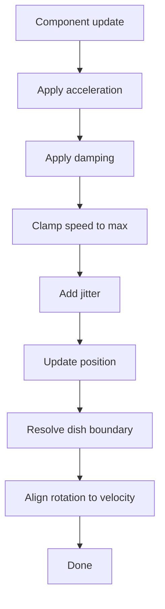

# Phase 1.4 — Basic Movement System (Godot 4.5)

This document instructs the Code AI agent to implement the movement pipeline for entities, enabling autonomous wandering, smooth motion, simple collision response, and boundary compliance inside the Petri dish.

Source of truth for scope: see [AGENTS/phased_plan.md](AGENTS/phased_plan.md:39-47).

---

Prerequisites
- Phase 1.3 completed and Petri dish available with boundary helpers in [scripts/environments/PetriDish.gd](scripts/environments/PetriDish.gd:61-90).
- Base entity component loop present in [scripts/components/BaseEntity.gd](scripts/components/BaseEntity.gd:65-68).
- Base entity scene exists at [scenes/entities/BaseEntity.tscn](scenes/entities/BaseEntity.tscn).

Deliverables
- Movement component at [scripts/components/MovementComponent.gd](scripts/components/MovementComponent.gd).
- Random wander behavior at [scripts/behaviors/RandomWander.gd](scripts/behaviors/RandomWander.gd).
- Optional movement helpers at [scripts/utils/MovementUtils.gd](scripts/utils/MovementUtils.gd).
- A simple test spawner added temporarily to [scenes/Main.tscn](scenes/Main.tscn) or [scenes/Game.tscn](scenes/Game.tscn) to verify behavior.

Implementation Overview
- Add a component that integrates acceleration based movement and updates PhysicalComponent position and rotation.
- Add a behavior component that periodically chooses a new direction and biases acceleration towards it with jitter.
- Apply soft separation forces for entity to entity bumping using local overlap queries.
- Enforce dish bounds and reflect velocity using the boundary helpers in [scripts/environments/PetriDish.gd](scripts/environments/PetriDish.gd:74-90).

Mermaid Diagram

Step by Step Tasks
1. Create MovementComponent
   - File: [scripts/components/MovementComponent.gd](scripts/components/MovementComponent.gd)
   - Data
     - velocity: Vector2
     - acceleration: Vector2
     - max_speed: float export
     - damping: float export in range 0.0 to 1.0 per second
     - jitter_strength: float export for Brownian like noise
     - align_rotation: bool export
   - On init
     - Cache owner Area2D and locate PhysicalComponent
     - Locate PetriDish node by group Dish or parent traversal
   - On update each frame
     - Integrate velocity with acceleration scaled by delta
     - Apply exponential damping to velocity using damping and delta
     - Clamp speed to max_speed
     - Add small random Vector2 scaled by jitter_strength and delta
     - Advance position via PhysicalComponent
     - Use dish boundary helpers in [scripts/environments/PetriDish.gd](scripts/environments/PetriDish.gd:74-90) to keep entities within the radius and reflect velocity
     - If align_rotation true and speed above epsilon set rotation to atan2 of velocity

2. Implement RandomWander behavior
   - File: [scripts/behaviors/RandomWander.gd](scripts/behaviors/RandomWander.gd)
   - Purpose
     - Pick a target direction every interval and bias MovementComponent acceleration towards that direction
   - Data
     - change_interval: float export default 0.8 seconds
     - magnitude: float export for acceleration magnitude
     - elapsed: float internal timer
   - Update loop
     - Accumulate delta
     - If timer exceeds change_interval choose a new random unit direction
     - Set MovementComponent acceleration to direction times magnitude
     - Optionally lerp previous direction to new one for smoother turning

3. Add entity to entity bumping
   - Approach
     - Each frame compute a small separation vector by iterating owner.get_overlapping_areas limited to a small count
     - For each neighbor compute delta vector and distance based on PhysicalComponent sizes and add a repulsion proportional to overlap
     - Apply the separation as an additional acceleration or directly adjust velocity slightly
   - Notes
     - Keep the effect subtle to avoid oscillation
     - Skip if neighbor is queued for deletion

4. Movement validation within dish bounds
   - Use clamp and reflect logic from the boundary helpers in [scripts/environments/PetriDish.gd](scripts/environments/PetriDish.gd:74-90)
   - When reflected reduce speed slightly to simulate energy loss if desired by multiplying velocity by a restitution factor such as 0.9

5. Rotation alignment with movement direction
   - When speed is above a small threshold set PhysicalComponent rotation using current velocity vector

Integration and Wiring
- Do not modify default attachments in [scripts/components/BaseEntity.gd](scripts/components/BaseEntity.gd:15-35)
- For testing attach MovementComponent and RandomWander to spawned entities through a temporary test spawner placed in [scenes/Game.tscn](scenes/Game.tscn) or [scenes/Main.tscn](scenes/Main.tscn)
- Later organism specific scenes will include MovementComponent and behaviors directly

Acceptance Criteria
- MovementComponent exists and updates entity positions smoothly with damping and speed clamping
- RandomWander produces visibly meandering paths with occasional direction changes and jitter
- Entities stay inside the dish and bounce off the boundary using reflection
- Entities exhibit gentle bumping when overlapping and separate without tunneling
- Entity rotation aligns to travel direction when align_rotation is enabled
- No errors in the component update loop noted in [scripts/components/BaseEntity.gd](scripts/components/BaseEntity.gd:65-68)

Test Procedure
- Add a temporary spawner that creates 20 BaseEntity instances each with MovementComponent and RandomWander
- Place them near the center using PetriDish get_random_point with a spawn margin from [scripts/environments/PetriDish.gd](scripts/environments/PetriDish.gd:92-96)
- Run the scene and observe for at least 60 seconds
- Verify that no entity escapes the dish, motion remains smooth, and no NaN positions occur
- Toggle align_rotation and confirm heading alignment visually
- Increase entity count to 200 and verify stable frame rate and no exponential overlaps

Performance and Safety Notes
- Avoid allocating new objects per frame except for small local vectors
- Use randomness from Godot randf and ensure seeding occurs once at startup
- Cap the number of neighbors processed per frame when computing separation to a small constant such as 6

Out of Scope for this Phase
- Spatial grid optimization planned in Phase 1.5
- Advanced pathfinding or pursuit
- State machine integration and sensing

Handoff Notes for Implementation
- Keep scripts under 500 lines and follow folder structure defined in [AGENTS/system_architecture.md](AGENTS/system_architecture.md:582-602)
- Expose tuning parameters via export so designers can tweak in the editor
- Use signals via [scripts/systems/GlobalEvents.gd](scripts/systems/GlobalEvents.gd) only if needed; this phase can be purely local logic
- Document any deviations in a short header comment in each new script file