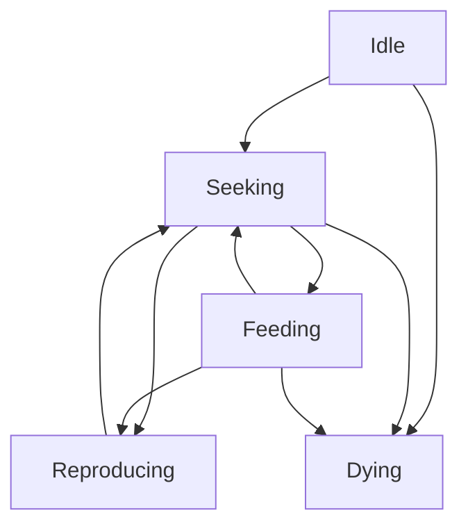

# Phase 2.3 — State Machine System — Implementation Guide for Code AI

Document intent
- Provide concrete, testable implementation instructions to complete Phase 2.3 of AGENTS/phased_plan.md for Godot 4.5 using GDScript best practices.
- Avoid hardcoding species specifics in the core state machine; keep it reusable.
- Integrate cleanly with existing components and behaviors from prior phases without breaking current gameplay.

Repository observations to align with
- A minimal State base exists at (scripts/behaviors/state/State.gd) with lifecycle hooks [enter()](scripts/behaviors/state/State.gd:6), [update()](scripts/behaviors/state/State.gd:9), [exit()](scripts/behaviors/state/State.gd:12).
- A simple StateMachine exists at (scripts/behaviors/state/StateMachine.gd) with [set_state()](scripts/behaviors/state/StateMachine.gd:7), [update()](scripts/behaviors/state/StateMachine.gd:15), [is_in()](scripts/behaviors/state/StateMachine.gd:19) but no stack support.
- Behavior orchestration is currently owned by (scripts/behaviors/BehaviorController.gd) which creates a state machine instance, enters Seeking on init, transitions to Reproducing when allowed, and moves to Dying on BiologicalComponent died signal. See terminal callback [_on_bio_died()](scripts/behaviors/BehaviorController.gd:201).
- Existing bacteria states are present under (scripts/behaviors/bacteria/). Seeking is minimal and compatible with steering behaviors: (scripts/behaviors/bacteria/BacteriaStateSeeking.gd).

Scope for this phase
- Enhance and generalize the StateMachine to support a stack of states with safe transition semantics.
- Standardize the State interface and metadata for debugging.
- Implement the organism states: Idle, Seeking, Feeding, Reproducing, Dying (bacteria-first, structure supports future species).
- Define state transition conditions and validation rules with deterministic priorities.
- Add state history tracking for debugging and telemetry.
- Implement state-specific visual indicators that are compatible with the MultiMesh based Rendering and Instancing System (RIS).
- Provide a state machine visualization for selected entities in the debug overlays.

High-level design principles
- Decouple logic from rendering: states may request visual hints by setting simple attributes on the entity such as base_color or physical size, which the RIS reads. No CanvasItem drawing inside states in production builds.
- Avoid per-frame allocations: construct state instances once per entity and reuse; do not allocate transient arrays in hot paths.
- Deterministic transitions: all transitions either happen at a single well-defined point per tick or are deferred to the next tick to avoid reentrancy/oscillation.
- Debuggability: every transition captures who, when, from, to, and reason; history is bounded to a small ring buffer.

Architecture and files to modify or add
- Core state system
  - Update (scripts/behaviors/state/State.gd) only if needed to add optional metadata helpers such as state_name and state_color accessors. Preserve the existing lifecycle hooks [enter()](scripts/behaviors/state/State.gd:6), [update()](scripts/behaviors/state/State.gd:9), [exit()](scripts/behaviors/state/State.gd:12).
  - Extend (scripts/behaviors/state/StateMachine.gd) to support a state stack and safe transitions. Keep public API backwards-compatible with [set_state()](scripts/behaviors/state/StateMachine.gd:7) and [is_in()](scripts/behaviors/state/StateMachine.gd:19).
- Behavior controller
  - Keep orchestration centralized in (scripts/behaviors/BehaviorController.gd). Add transition requests through the new stack-capable API. Preserve existing hooks for reproduction and death.
- Species states
  - Ensure bacteria states exist for Idle, Seeking, Feeding, Reproducing, Dying in (scripts/behaviors/bacteria/). Reuse and align existing files where present.
- Debug and UI
  - Add optional debug-only overlays under the HUD or a dedicated debug layer to visualize current state for the selected entity. No production rendering code inside states.

State machine behavior model

Mermaid overview

Core semantics
- Stack operations
  - push_state: enter a higher priority transient state while preserving the current one below.
  - pop_state: exit the current state and resume the previous one.
  - replace_state: equivalent to set_state, clears the current top and enters another state.
  - clear: empty the stack and set to a default fallback if required.
- Safety
  - Disallow pushing duplicates of the same state consecutively unless explicitly allowed by a state flag.
  - Prevent push or pop inside a state lifecycle callback from triggering reentrant transitions; collect transition requests and apply after the current update pass.
  - Validate state ownership: only state instances registered in the controller can be pushed.
- Ownership and lifetime
  - BehaviorController owns one instance of each state class it may use; construct once in init and reuse for the entity lifetime.
  - State instances are RefCounted and must not capture external nodes beyond the controller and cached components provided by the controller.
- Update order
  - BehaviorController.update invokes StateMachine.update once per frame.
  - StateMachine.update calls current_state.update exactly once per frame, then applies any deferred transition request.

State base class contract

Do not change existing hooks; extend with optional self-description:
- Lifecycle hooks remain as defined in (scripts/behaviors/state/State.gd):
  - [enter()](scripts/behaviors/state/State.gd:6)
  - [update()](scripts/behaviors/state/State.gd:9)
  - [exit()](scripts/behaviors/state/State.gd:12)
- Recommended metadata helpers (non-mandatory, no hard runtime dependency):
  - state_name: short human-readable identifier, default to the class_name or a provided StringName.
  - state_tint: optional Color hint used by BehaviorController for RIS-friendly visual feedback.
  - is_transient: bool indicating whether the state is expected to be short lived and pushed atop another.

StateMachine extension plan

Add the following capabilities as operations and internal behavior (describe, avoid code):
- Internal stack: array of State entries carrying {name, state_ref}.
- Public ops:
  - push operation that validates, calls exit on current top, then enter on new top, or alternately pauses/resumes if you later adopt pause semantics. For this phase, use strict exit then enter.
  - pop operation that exits current top and re-enters the previous top.
  - replace operation that exits current top and enters the provided state (backwards-compatible alias for existing set_state).
  - peek operation returning current name and reference.
  - clear operation removing all states and optionally entering a provided default.
- Deferred transitions:
  - During update, collect at most one pending transition request; apply after current state.update completes.
  - If multiple requests occur, keep the highest-priority one using a simple priority order: pop > replace > push to avoid stale top resuming unintentionally.
- Validation:
  - Reject pushes of null states or unknown names with a logged warning under Log.gd category.
  - No-ops for popping on an empty stack.
- Telemetry:
  - Expose read-only properties for current name and stack depth.
  - Emit optional signals for on_state_changed and on_stack_changed guarded by debug flag.

Organism states and responsibilities

Define these bacteria states under (scripts/behaviors/bacteria/):
- Idle
  - Purpose: baseline low-activity behavior when no stimuli are detected or when throttling updates for performance.
  - Behavior: zero or low acceleration, allow metabolism and passive drift if present.
  - Visual hint: slightly reduced alpha or desaturated color to indicate low activity.
- Seeking
  - Purpose: default navigation using RandomWander and SeekNutrient behaviors already present.
  - Behavior: no direct steering inside the state; rely on existing movement components and behaviors. Reset visuals from previous states.
  - Visual hint: default base color and baseline size.
- Feeding
  - Purpose: short-lived state when consuming a nutrient in contact range. Overrides movement to lock onto target and briefly slow movement.
  - Behavior: request nutrient consumption via existing overlap event path and prevent immediate re-seeking until a short cooldown ends.
  - Visual hint: brief color brighten or size pulse compatible with RIS.
- Reproducing
  - Purpose: binary fission flow.
  - Behavior: use BiologicalComponent.apply_reproduction_bookkeeping to split energy, spawn offspring via BehaviorController helper, and emit any particle burst using BehaviorController.start_fission_burst. On completion, return to Seeking.
  - Visual hint: short size growth then settle, or particle burst via the optional CPUParticles2D node attached to the entity.
- Dying
  - Purpose: terminal state; owns polished exit path and ensures destruction flows through EMS.
  - Behavior: stop movement, trigger destruction after a short visual sequence. Finalize by invoking EntityFactory.destroy_entity if the controller-managed flow requires it.
  - Visual hint: fade out alpha and/or shrink radius.

Transition conditions and priorities

Implement transition decisions in BehaviorController with clear priority to avoid oscillation. Use simple, deterministic rules:
- Highest priority: Dying
  - Source: BiologicalComponent.died signal handled in BehaviorController callback [_on_bio_died()](scripts/behaviors/BehaviorController.gd:201).
  - Action: replace current with Dying unconditionally.
- Reproducing
  - Condition: BiologicalComponent.should_reproduce and controller.can_reproduce_now gates are true, and not currently Dying.
  - Action: replace Seeking or Feeding with Reproducing; block re-entry by cooldown in BiologicalComponent.
- Feeding
  - Condition: entity is overlapping a nutrient or has an active consume target set by SeekNutrient behavior. Avoid entering if Reproducing or Dying is active.
  - Action: push Feeding atop Seeking so that pop resumes Seeking naturally after consumption completes.
- Seeking
  - Default fallback when no higher-priority conditions are active.
  - Action: ensure at least Seeking is present when the stack becomes empty.
- Idle
  - Condition: optional power-saving when energy low but not dying, or when no nutrients detected for an extended period.
  - Action: replace Seeking with Idle if desired. Any stimulus returns from Idle to Seeking.

State history tracking

Add bounded history to BehaviorController:
- Structure: ring buffer of fixed capacity storing entries {timestamp_sec, from_state, to_state, reason}.
- Capacity: default 32 entries, configurable via ConfigurationManager.
- Write points: whenever StateMachine applies a transition.
- Exposure: a get_state_history method on BehaviorController returns a copy of recent entries for debug UI.

Visual indicators aligned with RIS

Do not add per-entity CanvasItem drawing for production visuals. Instead:
- Use BaseEntity.base_color tint changes and PhysicalComponent.size scaling for per-state hints; RIS will reflect them in instanced rendering.
- Keep visual changes small and time-bounded to avoid constant dirty flags on RIS buffers.
- For debug-only overlays, add a label or ring in a debug layer that displays current state for the selected entity. Ensure this is behind a debug flag and not used in production builds.

Debug visualization for selected entity

Implement a minimal debug layer feature:
- When an entity is selected, display its current state name near it or in the HUD inspector area.
- Optionally draw a thin colored outline whose color maps to the state (only in debug builds).
- Source of truth for current state is BehaviorController; do not query states directly from renderer.

Performance and update budget

- StateMachine operations must be O(1).
- No allocations on a per-frame basis inside State.update or transition logic.
- Avoid get_node chains per frame; BehaviorController already caches component references.
- Limit visual changes that mark RIS instances dirty every frame; use one-shot pulses or infrequent updates.

Implementation checklist for the Code AI

1) Extend StateMachine with stack operations
- Add internal stack storage and implement push, pop, replace, clear, peek.
- Add deferred transition handling to avoid reentrancy during update.
- Maintain current state name and depth exposure.
- Backward compatibility: keep [set_state()](scripts/behaviors/state/StateMachine.gd:7) behavior as a replace operation under the hood.
- Acceptance: unit exercise via a simple test script or in-sim logs show correct enter and exit order for push and pop.

2) Standardize State metadata
- Add optional helpers on State for state_name and state_tint defaults.
- Acceptance: BehaviorController can read state_name for UI without reflection or string hacks.

3) Implement or align bacteria states
- Ensure Idle, Seeking, Feeding, Reproducing, Dying exist under (scripts/behaviors/bacteria/), following the responsibilities above.
- Ensure Seeking remains a minimal pass-through that resets visuals and lets steering behaviors run. See (scripts/behaviors/bacteria/BacteriaStateSeeking.gd).
- Ensure Reproducing and Dying are terminal or transient as appropriate, returning control to Seeking on completion or to destruction flow.
- Acceptance: each state cleanly sets up and tears down any visual hints; no lingering effects after exit.

4) Wire transitions in BehaviorController
- Apply prioritized transition rules in update and died callback as described.
- Use stack operations: push for Feeding, replace for Reproducing and Dying, ensure Seeking fallback.
- Acceptance: run-time logs show expected transitions under nutrient contact, reproduction thresholds, and death events.

5) Add state history
- Implement ring buffer in BehaviorController with timestamped transitions and reasons.
- Add getters for UI/debug access.
- Acceptance: selecting an entity shows last N transitions in the debug inspector.

6) Debug visualization
- Implement a minimal overlay or HUD element that shows the current state for the selected entity.
- Ensure this is gated by a debug toggle and has negligible performance impact when disabled.
- Acceptance: when debug is on and an entity is selected, the state name is visible and updates on transitions.

7) Visual hints integration with RIS
- Use BaseEntity.base_color and PhysicalComponent.size as the only per-entity visual adjustments in states for now.
- Keep changes short-lived and avoid per-frame variation that causes constant dirty flags.
- Acceptance: visual hints are clearly visible during Feeding, Reproducing, and Dying without framerate degradation.

8) Validation and testing
- Create a small spawn scenario with several bacteria and nutrients.
- Verify:
  - Default state is Seeking on spawn.
  - Feeding triggers on overlap and returns to Seeking on completion.
  - Reproducing triggers at threshold and cools down; offspring are created with correct inheritance and energy split.
  - Dying triggers on starvation and interrupts any other state.
  - State history records all transitions with sensible reasons.
  - Debug visualization shows accurate current state.
- Performance: confirm steady 60 fps at population scales used in Phase 2 test scenes.

Acceptance criteria mapping to phased_plan.md

- Implement StateMachine base class with state stack
  - The extended (scripts/behaviors/state/StateMachine.gd) supports push, pop, replace, clear, peek, with deferred transitions and history hooks.
- Create State base class with enter, update, exit
  - Already present at (scripts/behaviors/state/State.gd); ensure optional metadata helpers without breaking existing signatures.
- Implement organism states: Idle, Seeking, Feeding, Reproducing, Dying
  - Bacteria variants implemented and wired; Seeking reuses steering behaviors; Reproducing and Dying align with existing controller helpers.
- Add state transition conditions and validation
  - Deterministic priority rules implemented in BehaviorController; validation guards in StateMachine.
- Create state history tracking for debugging
  - Ring buffer present; UI can surface history for selected entity.
- Implement state-specific animations and visual indicators
  - Via RIS-friendly color and size hints; optional particle burst for reproduction where present.
- Add state machine visualization for selected entities
  - Debug-only label or HUD entry shows current state and can optionally color-code.

Risks and mitigations

- Risk: state thrashing between Feeding and Seeking due to noisy contact events
  - Mitigation: add a brief stickiness timer inside Feeding or a cool-off window before re-entering Feeding.
- Risk: reentrant transitions causing double enter or exit
  - Mitigation: implement deferred transitions and a reentrancy guard in StateMachine.update.
- Risk: performance regressions from frequent visual changes
  - Mitigation: limit visual updates to one-shot pulses or state boundary changes; avoid per-frame tints.
- Risk: stale signals on destruction
  - Mitigation: BehaviorController.cleanup ensures disconnection; Dying state centralizes the finalization sequence.

Deliverables for this phase

- Updated files
  - (scripts/behaviors/state/StateMachine.gd) with stack support and deferred transitions.
  - (scripts/behaviors/state/State.gd) with optional metadata helpers (if added).
  - (scripts/behaviors/BehaviorController.gd) wired for prioritized transitions, history recording, and debug exposure.
- New or aligned files
  - 
  - 
  - Ensure existing (scripts/behaviors/bacteria/BacteriaStateSeeking.gd) remains minimal and resets visuals on enter.
  - Ensure BacteriaStateReproducing.gd and BacteriaStateDying.gd match the responsibilities above.
- Debug visualization
  - Minimal state display in debug mode for selected entity via HUD or a dedicated debug draw script.
- Notes in code
  - Brief docstrings at top of each state script describing responsibilities and any required controller helpers.

Test procedure summary

- Spawn a small population with nutrients:
  - Observe default Seeking, Feeding on contact, return to Seeking, Reproducing at threshold, and Dying on starvation.
- Verify state history logs transitions with reasons and timestamps.
- Toggle debug visualization and select a bacterium to see current state updates.
- Stress test with 300 to 500 bacteria to confirm no frame time regressions and no leaks.

Traceability to architecture v2

- Behavior Control System BCS: this phase implements the Hybrid State Machine portion and prepares for later utility scoring integration without changing current steering behaviors. See [AGENTS/system_architecture_v2.md](AGENTS/system_architecture_v2.md).
- Rendering and Instancing System RIS: state visuals use only tint and size adjustments readable by renderers; no per-entity draw in production. See renderer guidance in [AGENTS/system_architecture_v2.md](AGENTS/system_architecture_v2.md).

---

Confirmed execution decisions (from phase lead)

These choices are final for Phase 2.3 and should be implemented as specified below.

1) State stack semantics in (scripts/behaviors/state/StateMachine.gd)
- Use exit/enter transitions on push and pop with deferred application (no pause/resume callbacks in this phase).
- Maintain backward-compatible replace semantics for set_state while internally using the new stack-aware implementation.
- Reentrancy guard: collect at most one transition request during a state update and apply after update returns, preferring pop &gt; replace &gt; push if multiple are requested.
- Acceptance: enter/exit order is deterministic during push/pop in a unit exercise or logged trace.

2) Feeding trigger path
- Trigger Feeding by pushing it atop the stack when the organism has an active nutrient target lock exposed by (scripts/behaviors/SeekNutrient.gd) and overlap/contact is detected by the organism’s sensing/collision path.
- Do not rely on GlobalEvents for the transition trigger; GlobalEvents.nutrient_consumed remains a bookkeeping/energy path, not the entry condition.
- Apply a short internal cool-off window (200–400 ms) inside Feeding to prevent rapid oscillation. Make the duration configurable via (scripts/systems/ConfigurationManager.gd).
- On Feeding completion or timeout, pop Feeding to resume the underlying Seeking state.

3) Debug visualization location
- Embed a simple state label in the existing HUD inspector pipeline at [scenes/ui/HUD.tscn](scenes/ui/HUD.tscn). Gate its visibility behind a configuration/debug flag.
- The HUD should read the current state name from BehaviorController (do not query state internals directly). If selection is not yet implemented, implement a temporary hook that shows the state for a debug-selected entity.

4) Configuration keys (add to (scripts/systems/ConfigurationManager.gd))
- bacteria_feeding_cooldown_ms: int (default 250). Cool-off window preventing immediate re-entry into Feeding after a Feeding instance completes.
- debug_show_states: bool (default false). Toggles the HUD state label visualization for selected/current debug entity.
- Notes:
  - Keep names stable; place under the same namespace/pattern used for existing bacteria and debug keys.
  - Ensure hot reload is safe or document that values are read at startup.

Checklist alignment updates (apply to the implementation steps above)
- StateMachine: implement push/pop/replace/clear/peek using exit/enter semantics; ensure set_state remains a replace operation. Add deferred transition handling and validation.
- Feeding state: implement as a transient push with an internal timer driven by bacteria_feeding_cooldown_ms; entry requires active target lock from (scripts/behaviors/SeekNutrient.gd) plus overlap.
- BehaviorController: prioritize transitions Dying &gt; Reproducing (replace) &gt; Feeding (push) &gt; Seeking fallback; never enter Feeding from the GlobalEvents consumption callback.
- HUD debug: surface current state name when debug_show_states is true via [scenes/ui/HUD.tscn](scenes/ui/HUD.tscn); ensure negligible cost when disabled.

Acceptance criteria additions
- Feeding transition fires only on target lock + overlap and respects bacteria_feeding_cooldown_ms; no thrashing under noisy contacts.
- HUD state label appears only when debug_show_states is true and a debug-selected entity exists; label updates on transitions without stutter.
- No new per-frame allocations from the added stack/deferred logic; stack operations are O(1).

Traceability
- These decisions refine the guidance already provided in this document and align with Behavior Control System goals in [AGENTS/system_architecture_v2.md](AGENTS/system_architecture_v2.md).
