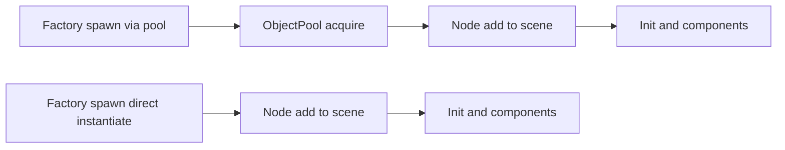
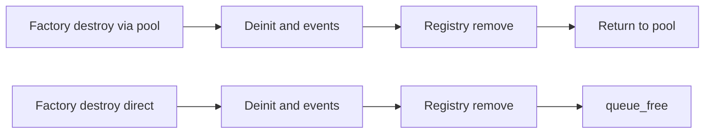

# Refactor Idea: Remove Object Pooling from EntityFactory and transition to instantiate/queue_free (2D), prep for MultiMesh RIS

Summary
- Replace pooling in [EntityFactory.gd](scripts/systems/EntityFactory.gd) with instantiate and queue_free to simplify lifecycle ahead of a MultiMeshInstance2D renderer.
- Keep [ObjectPool.gd](scripts/utils/ObjectPool.gd) as an optional utility for UI or effects; remove it from the core entity path.
- Preserve spawn/init/destroy order, logging, GlobalEvents, and [EntityRegistry.gd](scripts/systems/EntityRegistry.gd) behavior.

Current state and references
- Pools are created and used in [EntityFactory._ready()](scripts/systems/EntityFactory.gd:16), [EntityFactory.create_entity()](scripts/systems/EntityFactory.gd:55), and [EntityFactory.destroy_entity()](scripts/systems/EntityFactory.gd:91).
- Pool implementation is in [ObjectPool.acquire()](scripts/utils/ObjectPool.gd:21) and [ObjectPool.release()](scripts/utils/ObjectPool.gd:31).
- Visuals are per node via [BaseEntity._draw()](scripts/components/BaseEntity.gd:96) with per frame queue_redraw in [BaseEntity._process()](scripts/components/BaseEntity.gd:91).
- Pool-related signal [BaseEntity.ready_for_pool](scripts/components/BaseEntity.gd:8) is emitted in [BaseEntity.deinit()](scripts/components/BaseEntity.gd:86) but unused by listeners.
- Pool sizes and mappings live in [ConfigurationManager.entity_pool_sizes](scripts/systems/ConfigurationManager.gd:39) and [ConfigurationManager.entity_scene_paths](scripts/systems/ConfigurationManager.gd:46).

Scope
- Remove pooling from [EntityFactory.gd](scripts/systems/EntityFactory.gd) and [ConfigurationManager.gd](scripts/systems/ConfigurationManager.gd).
- Remove the unused signal emission from [BaseEntity.gd](scripts/components/BaseEntity.gd).
- Do not introduce MultiMeshInstance2D yet; this task is lifecycle simplification only.

Non goals
- No ECS migration or removal of physics interactions in this change.
- No MultiMesh renderer yet; that follows as a separate task.

Implementation guidance for the code agent

1) EntityFactory._ready
- Keep root parent resolution and _scene_map seeding.
  - Keep lines resolving current_scene and DishContainer in [EntityFactory._ready()](scripts/systems/EntityFactory.gd:18).
  - Keep seeding of _scene_map from [ConfigurationManager.entity_scene_paths](scripts/systems/ConfigurationManager.gd:46).
- Remove pool infrastructure:
  - Remove creation of _pool_container and its child node [PoolContainer](scripts/systems/EntityFactory.gd:29).
  - Remove _default_pool creation and configuration [ObjectPool](scripts/systems/EntityFactory.gd:34).
  - Remove per type pool construction and configure loop [EntityFactory.gd](scripts/systems/EntityFactory.gd:45).
  - Stop reading [ConfigurationManager.entity_pool_sizes](scripts/systems/ConfigurationManager.gd:39).

2) EntityFactory.create_entity
- Resolve scene_path using _scene_map; fallback to [BASE_ENTITY_SCENE](scripts/systems/EntityFactory.gd:4).
- Instance the PackedScene and cast to BaseEntity; if instantiation fails, return an empty StringName like the current behavior.
- Parent to _root_parent before init to preserve component attach behavior.
- Maintain current initialization semantics:
  - Set entity_type, merge params with position, call node.init, call physical.update if present.
  - Add SpatialTrackerComponent, collect id from identity, log, add to registry, emit entity_spawned.
- Remove any pool.acquire usage and null checks tied to pooling.

3) EntityFactory.destroy_entity
- Maintain current sequence: deinit, emit entity_destroyed, remove from EntityRegistry.
- If the node has a parent, remove it from the parent.
- Call queue_free on the node.
- Remove pool lookup and pool.release usage entirely.

4) EntityFactory.register_entity_scene
- Keep updating _scene_map for overrides.
- Remove pool reconfigure behavior; no pools remain.

5) BaseEntity cleanup
- Remove the unused signal declaration [BaseEntity.ready_for_pool](scripts/components/BaseEntity.gd:8).
- Remove the emit_signal call inside [BaseEntity.deinit()](scripts/components/BaseEntity.gd:86).
- Preserve the cleanup loop over components.

6) ConfigurationManager cleanup
- Remove [entity_pool_sizes](scripts/systems/ConfigurationManager.gd:39) and [get_entity_pool_size](scripts/systems/ConfigurationManager.gd:55).
- Keep [entity_scene_paths](scripts/systems/ConfigurationManager.gd:46) and its getter if desired.
- Update any inline comments that imply pooling is required.

7) ObjectPool utility
- Keep [ObjectPool.gd](scripts/utils/ObjectPool.gd) available for UI or effects as an optional utility.
- Consider adding a deprecation header comment indicating it is not used by core entity lifecycle.

Developer notes and gotchas
- Maintain the ordering used today to avoid subtle bugs: parent to tree before init so _ready component attachments are available, then init, then physical.update.
- Avoid calling load for every spawn in tight loops; consider preloading scenes or caching PackedScenes at the factory level in a later optimization step.
- Ensure GlobalEvents and logging calls remain identical so dependent systems and debugging expect the same sequence.
- Keep identity component existence check and creation to preserve ids for new instances.

Verification checklist
- Launch scene and observe initial nutrient population:
  - [NutrientManager._ready()](scripts/systems/NutrientManager.gd:28) → initial spawn matches target_count.
- Reconcile and respawn:
  - [NutrientManager._on_reconcile_timeout](scripts/systems/NutrientManager.gd:89) and [_on_respawn_timeout](scripts/systems/NutrientManager.gd:122) continue to create and destroy entities without errors.
- EntityRegistry:
  - [EntityRegistry.count_by_type](scripts/systems/EntityRegistry.gd:26) returns expected values during gameplay.
- No pool artifacts:
  - No [PoolContainer](scripts/systems/EntityFactory.gd:29) child exists at runtime.
  - No calls to [ObjectPool.acquire()](scripts/utils/ObjectPool.gd:21) or [ObjectPool.release()](scripts/utils/ObjectPool.gd:31) remain in the codebase.
- No dangling signals:
  - [ready_for_pool](scripts/components/BaseEntity.gd:8) removed without any connect errors at startup.

Performance baseline
- Expect slightly higher cost from instantiation and freeing; use the built in profiler to sample frame times at:
  - nutrient_target_count from [ConfigurationManager](scripts/systems/ConfigurationManager.gd:12)
  - bacteria populations typical for your test scenarios
- Capture a baseline to compare against a future MultiMesh RIS.

Minimal flow change diagrams

Follow up task outline for MultiMeshInstance2D
- Introduce a Rendering and Instancing System RIS that owns MultiMeshInstance2D per archetype.
- On spawn, allocate an instance index from RIS and store renderer_id and instance_index on the entity or registry.
- On update, RIS consumes a compact buffer of transforms and colors to flush to MultiMesh each frame.
- On destroy, reclaim instance_index in RIS. Keep simulation unchanged initially.
- Gradually disable per entity _draw and migrate visuals to RIS once validated.

Rollback plan
- Keep a branch point before the refactor.
- If issues arise, restore pooling by reverting [EntityFactory.gd](scripts/systems/EntityFactory.gd) and [ConfigurationManager.gd](scripts/systems/ConfigurationManager.gd) to pre change state; no data migrations are needed.

Acceptance criteria
- Game runs without errors; spawn and destroy paths work under reconcile and respawn.
- No references to pooling remain in [EntityFactory.gd](scripts/systems/EntityFactory.gd) or [ConfigurationManager.gd](scripts/systems/ConfigurationManager.gd).
- [BaseEntity.gd](scripts/components/BaseEntity.gd) compiles and runs without the ready_for_pool signal.
- Performance baseline recorded for comparison with RIS work.

Links to key files for this task
- [scripts/systems/EntityFactory.gd](scripts/systems/EntityFactory.gd)
- [scripts/utils/ObjectPool.gd](scripts/utils/ObjectPool.gd)
- [scripts/components/BaseEntity.gd](scripts/components/BaseEntity.gd)
- [scripts/systems/ConfigurationManager.gd](scripts/systems/ConfigurationManager.gd)
- [scripts/systems/NutrientManager.gd](scripts/systems/NutrientManager.gd)