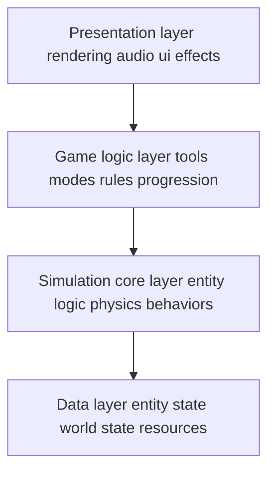
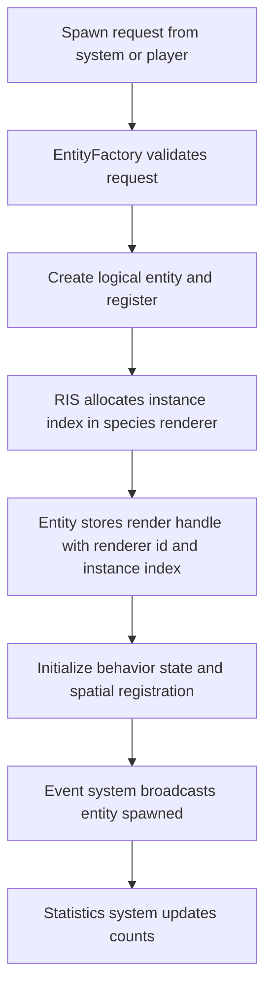
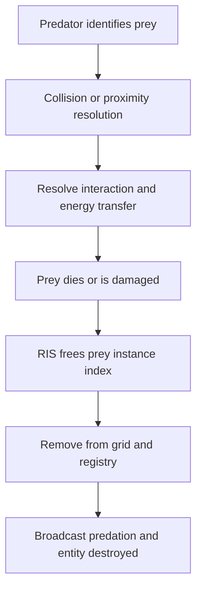
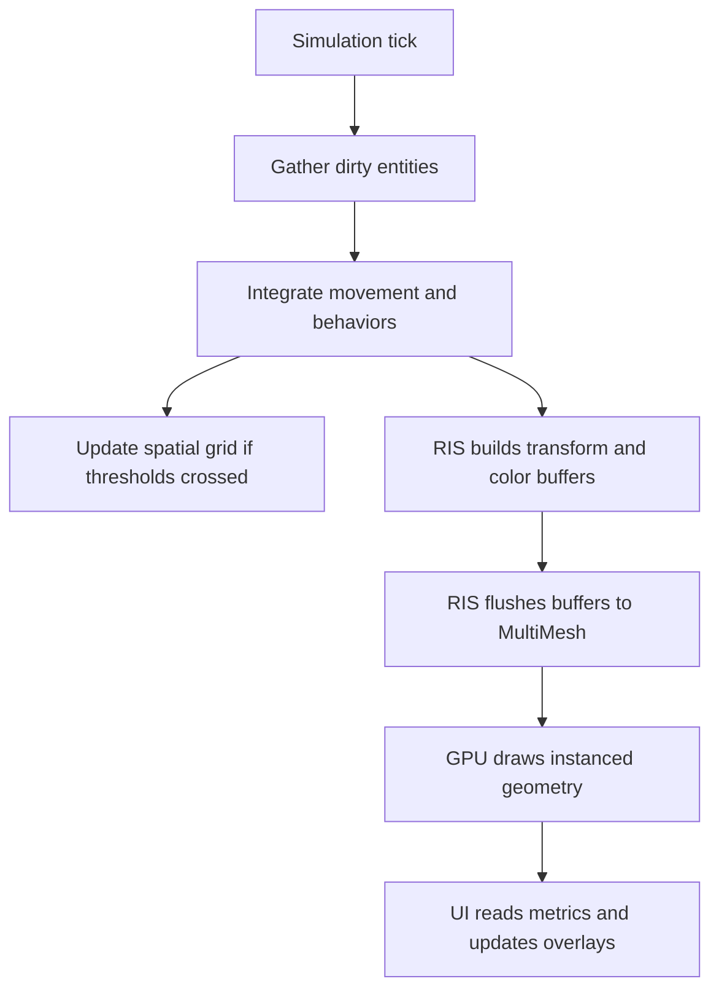

# System Architecture v2

The game simulates a virtual Petri dish where players can observe and interact with microorganisms in a sandbox environment, emphasizing emergent behaviors, biological interactions, and educational elements. The target is an MVP+ (Minimum Viable Product with select enhancements) to ensure a polished core experience while allowing for future expansions.

This document defines the system architecture for Petri Pandemonium, a 2D microorganism simulation game. The architecture prioritizes modularity, performance optimization for entity-heavy simulation, and clear separation of concerns. The design supports an MVP+ scope with provisions for future expansion including evolution mechanics, multiple game modes, and player intervention tools.

### Key Architectural Principles
- **Separation of Concerns**: Distinct layers for data, simulation, game logic, and presentation
- **Modularity**: Loosely coupled systems communicating through defined interfaces
- **Performance-First Design**: Architecture optimized for 500+ concurrent entities
- **Emergent Behavior Focus**: Systems designed to create complex behaviors from simple rules
- **Extensibility**: Foundation supports future features without major refactoring

---

## 1. System Overview

### 1.1 High-Level Architecture

The system follows a layered architecture pattern with unidirectional dependencies:

```
┌─────────────────────────────────────────────┐
│          Presentation Layer                 │
│  (Rendering, Audio, UI, Effects)           │
└─────────────────┬───────────────────────────┘
                  │
┌─────────────────▼───────────────────────────┐
│           Game Logic Layer                  │
│  (Tools, Modes, Rules, Progression)        │
└─────────────────┬───────────────────────────┘
                  │
┌─────────────────▼───────────────────────────┐
│         Simulation Core Layer               │
│  (Entity Logic, Physics, Behaviors)        │
└─────────────────┬───────────────────────────┘
                  │
┌─────────────────▼───────────────────────────┐
│            Data Layer                       │
│  (Entity State, World State, Resources)    │
└─────────────────────────────────────────────┘
```

## Petri Pandemonium — MultiMesh based Rendering Architecture

Purpose: replace the prior pooling centric design with a GPU instancing centric approach using MultiMeshInstance2D while preserving our modular, layered architecture and enabling scalable populations. Audience: AI code agents contributing to design and implementation across systems, guided by [AGENTS/proposal.md] and superseding the pooling guidance in [AGENTS/system_architecture.md].

---
---

## 2. High level architecture

The layered architecture remains with clarified responsibilities between simulation and rendering.



Key cross layer contracts:
- Simulation publishes entity state and events.
- Rendering consumes read only state and writes GPU instance buffers.
- Data layer remains the single source of truth for entity identities and world metrics.

---

## 3. Core systems overview

### 3.1  Module Specifications

### 3.1.1 Entity Management System (EMS)

- Entity Management System EMS
  - Tracks lifecycle and identity of entities.
  - Creates and destroys entities via the factory, updates registry, and emits events.
  - Does not perform pooling for simulation entities, insteaed uses MultiMeshInstance2D
  - Relevant files
    - [scripts/systems/EntityFactory.gd]
    - [scripts/systems/EntityRegistry.gd]

- Rendering and Instancing System RIS
  - Manages MultiMeshInstance2D renderers partitioned by species or visual archetype.
  - Owns instance index allocation, updates, and reclamation.
  - Batch flushes per frame to minimize API calls.
  - Candidate files and scenes
    - [scripts/rendering/BacteriaRenderer.gd]
    - [scenes/renderers/BacteriaRenderer.tscn]

### 3.1.2 Behavior Control System (BCS)

**Purpose**: Orchestrates AI behaviors and decision-making for all organisms.
  - Relevant files
    - [scripts/behaviors/RandomWander.gd]
    - [scripts/behaviors/SeekNutrient.gd]

**Architecture Pattern**: Hybrid State Machine with Utility AI scoring

**Core Components:**
- **BehaviorController**: Base controller managing behavior execution
- **StateManager**: Handles state transitions and state stacks
- **UtilityScorer**: Calculates action priorities based on needs/environment
- **BehaviorLibrary**: Repository of reusable behavior components

**Behavior Hierarchy:**
```
BaseBehavior
├── MovementBehaviors
│   ├── RandomWander
│   ├── SeekTarget
│   ├── FleeFrom
│   └── Swarm
├── FeedingBehaviors
│   ├── ConsumeNutrient
│   ├── HuntPrey
│   └── Photosynthesize
├── ReproductionBehaviors
│   ├── AsexualDivision
│   ├── Budding
│   └── ViralInfection
└── DefensiveBehaviors
    ├── Evade
    ├── Hide
    └── FormColony
```

**State Machine Structure:**
- States: Idle, Seeking, Feeding, Fleeing, Reproducing, Dying
- Transitions triggered by: Energy levels, threats, opportunities, timers
- Each organism type has customized state priorities

### 3.1.3 Physics and Spatial System (PSS)

**Purpose**: Manages spatial relationships, movement, and collision detection.
    - Relevant files
        - [scripts/systems/SpatialGrid.gd]
        - [scripts/components/MovementComponent.gd]
        - [scripts/components/SpatialTrackerComponent.gd]

**Approach**: Hybrid system using Godot's Physics2D for collisions, custom logic for movement and spatial queries.

**Core Components:**
- **SpatialPartitionGrid**: Divides dish into cells for efficient neighbor queries
- **MovementProcessor**: Calculates movement vectors and applies forces
- **CollisionHandler**: Processes collision events and triggers interactions
- **BoundaryManager**: Enforces Petri dish boundaries

**Optimization Strategies:**
- Grid-based spatial partitioning (16x16 default grid)
- Staggered update cycles for non-critical entities
- Distance-based LOD for behavior complexity
- Broad-phase collision culling


### 3.1.4 Resource Management System (RMS)

**Purpose**: Handles nutrients, energy, and environmental resources.
    - Relevant files
        - [scripts/systems/NutrientManager.gd]

**Core Components:**
- **NutrientManager**: Spawns, tracks, and replenishes nutrients
- **EnergyProcessor**: Calculates energy transfers and metabolism
- **EnvironmentController**: Manages environmental conditions (temperature, pH, toxins)
- **ResourceBalancer**: Maintains ecosystem equilibrium

**Resource Types:**
- Nutrients (consumed for energy)
- Oxygen/CO2 (future feature placeholder)
- Toxins/Antibiotics (player-placed hazards)
- Light (for photosynthetic organisms)


### 3.1.5 Event Broadcasting System (EBS)

**Purpose**: Decouples systems through event-driven architecture.
  - Relevant files
    - [scripts/systems/GlobalEvents.gd]

**Implementation**: Observer pattern with typed events

**Event Categories:**
- **Lifecycle Events**: EntitySpawned, EntityDied, EntityMutated
- **Interaction Events**: PredationOccurred, InfectionStarted, ReproductionComplete
- **Environmental Events**: NutrientDepleted, HazardPlaced, TemperatureChanged
- **Game Events**: ModeChanged, ToolActivated, ChallengeCompleted
- **UI Events**: EntitySelected, StatisticUpdated, NotificationTriggered

**Event Flow:**
1. System triggers event with data payload
2. EventBus routes to registered listeners
3. Listeners process asynchronously (non-blocking)
4. Optional event history for replay/undo

### 3.1.6 User Interface System (UIS)

**Purpose**: Manages all UI elements and user interactions.
- - Heads up display, stats, and controls.
  - Relevant scenes
    - [scenes/ui/HUD.tscn]


**Layer Structure:**
```
HUD Layer (Always visible)
├── Population Statistics
├── Resource Meters
├── Simulation Speed Control
└── Mode Indicator

Tool Layer (Contextual)
├── Tool Palette
├── Tool Options
└── Cursor Preview

Information Layer
├── Entity Inspector
├── Tooltips
├── Event Log
└── Educational Panels

Menu Layer
├── Pause Menu
├── Settings
└── Save/Load Interface
```

**Responsive Design Considerations:**
- Scalable UI for different resolutions
- Modular panels that can be hidden/shown
- Touch-friendly controls for future mobile version

### 3.1.7 Tool and Intervention System (TIS)

**Purpose**: Handles player interactions with the simulation.

**Tool Architecture:**
```
AbstractTool (Base)
├── PlacementTools
│   ├── OrganismPlacer
│   ├── NutrientDropper
│   └── HazardPlacer
├── EnvironmentalTools
│   ├── TemperatureAdjuster
│   ├── ChemicalSprayer
│   └── LightSource
├── PhysicalTools
│   ├── StirTool
│   ├── Pipette
│   └── Scraper
└── ObservationTools
    ├── Magnifier
    ├── Tracker
    └── Sampler
```

**Tool State Machine:**
- Inactive → Selected → Previewing → Executing → Cooldown → Inactive

**Validation System:**
- Pre-execution validation (can place here?)
- Resource cost checking
- Effect preview rendering
- Undo action recording

---

### 3.1.8 World State Model

- Environment and World
  - Petri dish boundary and debug draw.

**Global State Structure:**
```
WorldState
├── SimulationMetrics
│   ├── TimeElapsed
│   ├── GenerationCount
│   ├── TotalEntitiesSpawned
│   └── ExtinctionEvents
├── EnvironmentState
│   ├── Temperature
│   ├── pH_Level
│   ├── NutrientDensity
│   └── ActiveHazards[]
├── PopulationState
│   ├── SpeciesCount{}
│   ├── TotalBiomass
│   └── DiversityIndex
└── GameState
    ├── CurrentMode
    ├── ActiveChallenges[]
    ├── UnlockedTools[]
    └── PlayerScore
```

### 3.1.9 Configuration Resources

All balance parameters and game settings stored as Godot Resources:
- OrganismTemplates (base stats per species)
- BehaviorProfiles (AI personality variations)
- EnvironmentPresets (starting conditions)
- ChallengeDefinitions (win conditions, restrictions)
- ToolDefinitions (costs, effects, cooldowns)

---

## 4. Rendering and Instancing System RIS

Objectives
- Reduce draw calls by batching organisms of the same visual archetype with MultiMeshInstance2D.
- Keep the simulation authoritative and stateless with respect to rendering.
- Provide deterministic and observable instance index lifecycle for debugging and replay.

Structure
- One MultiMeshInstance2D per species or visual archetype for homogeneous appearance and shader parameters.
- RIS owns a registry of renderers keyed by species id or archetype id.
- Each entity that should be rendered holds a RenderHandle thin reference to its renderer id and instance index.

Instance lifecycle
- Allocate
  - On spawn, RIS assigns a free instance index from the appropriate renderer.
  - If capacity is insufficient, RIS grows the MultiMesh capacity with amortized strategy to avoid spikes.
- Update
  - Each frame, RIS collects dirty entities and updates their instance transforms, colors, and other per instance attributes in contiguous buffers.
  - Dirty tracking is driven by movement, size changes, color changes, and alive state transitions.
- Free
  - On destroy, RIS clears the instance data at the index and returns the index to the free list without shrinking capacity mid frame.

Data flow
- Transform2D per instance derived from entity position, orientation, and scale.
- Optional per instance color and size data drive simple shaders for variation.
- Shared materials and textures across instances within a renderer.

Integration points
- EMS signals spawn and destroy to RIS.
- PSS and BCS mark entities as dirty when movement or state changes.
- UIS may reference renderer population counts for on screen metrics.

Debugging and telemetry
- Optional overlay to visualize instance indices and renderer partitions.
- Periodic logging at reduced frequency via [scripts/systems/Log.gd].

---

## 5. Entity Management System updates

Responsibilities
- Instantiate and initialize logical entities, attach components, and register identities.
- Emit lifecycle events to other systems.
- No per entity CanvasItem drawing and no pooling for simulation entities.

Factory and registry
- Factory creates the logical entity and emits entity spawned.
- Registry is authoritative for id, type, and lookup lists, enabling RIS to find targets.

Legacy pooling
- The generic pool in [scripts/utils/ObjectPool.gd] remains available for non simulation utilities such as transient UI or audio if required.
- EMS does not reuse pooled Nodes for organisms and nutrients under the MultiMesh approach.

---

## 6. System interaction flows

Entity spawn flow v2



Predation and death sequence v2



Per frame update and render flush



---

## 7. Data architecture updates

Render handle fields
- renderer_id stable identifier for the RIS renderer that owns the instance.
- instance_index integer into the renderer MultiMesh capacity.
- tint_color and size_scale optional per instance attributes for simple variation.

Component model implications
- RenderComponent now holds RenderHandle and visual traits, but does not own drawing logic.
- BaseEntity keeps a debug draw path only for developer visualization and is disabled in production builds. See [scripts/components/BaseEntity.gd].

World state and statistics
- RIS exposes counts per renderer used by population metrics and UI.

Configuration resources
- Species visual presets define texture, base color, and size ranges that map to renderer archetypes.

**Component Structure:**

```
Entity
├── IdentityComponent
│   ├── UUID
│   ├── Type
│   ├── Generation
│   └── ParentID
├── PhysicalComponent
│   ├── Position
│   ├── Rotation
│   ├── Size
│   └── Mass
├── BiologicalComponent
│   ├── Energy
│   ├── Health
│   ├── Age
│   └── ReproductionTimer
├── TraitComponent
│   ├── Speed
│   ├── SenseRadius
│   ├── Resistances[]
│   └── MutationRate
├── BehaviorComponent
│   ├── CurrentState
│   ├── StateHistory
│   ├── Personality
│   └── TargetEntity
└── RenderComponent
    ├── Sprite/Shape
    ├── Color
    ├── AnimationState
    └── EffectOverlays
```

---

## 8. Performance and memory strategy

CPU and GPU responsibilities
- CPU
  - Simulation, AI decisions, spatial queries, dirty flagging, and buffer assembly.
- GPU
  - All organism drawing through instancing.

Batched updates
- Maintain a compact list of dirty entities to avoid full scans.
- Write instance data in contiguous spans where possible to leverage cache and reduce driver overhead.
- Limit flushes to once per frame per renderer unless hot swapping materials or textures.

Capacity management
- Prewarm capacity for expected populations to avoid runtime growth spikes.
- Use geometric growth for capacity increases to amortize cost.
- Never shrink capacity mid session to avoid fragmentation and stalls.

Culling and LOD
- View frustum culling is handled by engine, but RIS can reduce update frequency for off screen entities to lower CPU work.
- Shader driven simple variation avoids per instance material changes.

Target metrics
- 60 fps with 500 to 1000 simple instances on desktop export with forward plus rendering mode.

---

## 9. Migration notes and legacy references

What changed from v1
- Removed EntityPool responsibilities from EMS and any reliance on pooling for organisms and nutrients.
- Replaced per entity _draw paths with RIS managed instancing. Debug draw is behind a diagnostic flag.
- Spawn and destroy steps now include instance index allocation and reclamation in RIS.

What remains
- Registry, behaviors, spatial grid, and events maintain the same interfaces and responsibilities.

Where pooling still applies
- Short lived UI or audio objects may still use [scripts/utils/ObjectPool.gd] if needed.
- Effects may later move to GPU particles for similar batching gains.

Potential renderer files
- Bacteria visuals expected under [scripts/rendering/BacteriaRenderer.gd] and [scenes/renderers/BacteriaRenderer.tscn].

---

## 11. Scene and file topology

- Core scenes
  - [scenes/Main.tscn]
  - [scenes/Game.tscn]
  - [scenes/environments/PetriDish.tscn]
  - [scenes/ui/HUD.tscn]


- Autoloads (globals):
  - GlobalEvents.gd
  - WorldState.gd
  - ConfigurationManager.gd
  - EntityRegistry.gd
  - EntityFactory.gd
  - Log.gd


- Scripts
  - Systems
    - [scripts/systems/EntityFactory.gd]
    - [scripts/systems/EntityRegistry.gd]
    - [scripts/systems/SpatialGrid.gd]
    - [scripts/systems/NutrientManager.gd]
    - [scripts/systems/GlobalEvents.gd]
  - Components
    - [scripts/components/BaseEntity.gd]
    - [scripts/components/MovementComponent.gd]
    - [scripts/components/SpatialTrackerComponent.gd]
  - Rendering
    - [scripts/rendering/BacteriaRenderer.gd]

- Renderers scenes
  - [scenes/renderers/BacteriaRenderer.tscn]

Note: if a referenced renderer file is absent, create it under the indicated path to align with this architecture.

---

## 12. Risks and mitigations

- Risk stale instance indices if entities are destroyed without RIS notification
  - Mitigation ensure EMS destroy path always invokes RIS free and is idempotent.
- Risk frame spikes during capacity growth
  - Mitigation prewarm and geometric growth with soft ceilings.
- Risk logic render desynchronization
  - Mitigation maintain render handle on entity and validate at key events.
- Risk excessive logs during stress
  - Mitigation use throttled logging through [scripts/systems/Log.gd].

---

## 13. Success criteria v2

- Maintain 60 fps with 500 to 1000 active instanced organisms on desktop.
- Single flush per renderer per frame in steady state.
- Zero graphical artifacts after burst spawn and destroy cycles.
- Clear and actionable RIS telemetry during profiling.

---